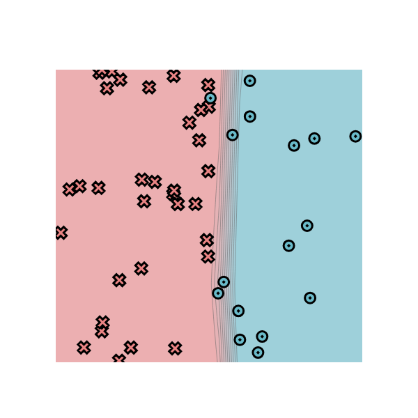
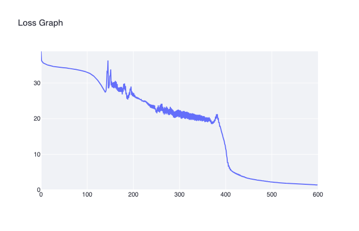

[](https://classroom.github.com/online_ide?assignment_repo_id=11608970&assignment_repo_type=AssignmentRepo)
# MiniTorch Module 0


* Docs: https://minitorch.github.io/

* Overview: https://minitorch.github.io/module0.html

## Task 0.5 Screenshot


[](https://classroom.github.com/online_ide?assignment_repo_id=11754853&assignment_repo_type=AssignmentRepo)

# MiniTorch Module 1


* Docs: https://minitorch.github.io/

* Overview: https://minitorch.github.io/module1/module1/

This assignment requires the following files from the previous assignments. You can get these by running

```bash
python sync_previous_module.py previous-module-dir current-module-dir
```

The files that will be synced are:

        minitorch/operators.py minitorch/module.py tests/test_module.py tests/test_operators.py project/run_manual.py


## Task 1.5 Training Results
### Dataset 1: Simple
Parameters: 
|  Hidden Layer Size  | Learning Rate  | Epoches |
|  ----  | ----  | ----  |
| 2  | 0.1 | 1000 |

Result:



Loss:


Training Logs:

```
Epoch: 0/1000, loss: 0, correct: 0
Epoch: 10/1000, loss: 33.92841760831122, correct: 34
Epoch: 20/1000, loss: 32.00604031553041, correct: 34
Epoch: 30/1000, loss: 31.300876657998238, correct: 34
Epoch: 40/1000, loss: 31.019783624788083, correct: 34
Epoch: 50/1000, loss: 30.843544591570602, correct: 34
Epoch: 60/1000, loss: 30.691485804526646, correct: 34
Epoch: 70/1000, loss: 30.532843251029362, correct: 34
Epoch: 80/1000, loss: 30.350733541006107, correct: 34
Epoch: 90/1000, loss: 30.145277881931392, correct: 34
Epoch: 100/1000, loss: 29.896995463595577, correct: 34
Epoch: 110/1000, loss: 29.592627707912857, correct: 34
Epoch: 120/1000, loss: 29.217292222630956, correct: 34
Epoch: 130/1000, loss: 28.75038912717578, correct: 34
Epoch: 140/1000, loss: 28.17577192729162, correct: 34
Epoch: 150/1000, loss: 27.455603771816257, correct: 34
Epoch: 160/1000, loss: 26.55597069782852, correct: 34
Epoch: 170/1000, loss: 25.467471261825683, correct: 35
Epoch: 180/1000, loss: 24.31754701595207, correct: 36
Epoch: 190/1000, loss: 23.062344856192237, correct: 39
Epoch: 200/1000, loss: 21.99431560588294, correct: 40
Epoch: 210/1000, loss: 20.94015289020804, correct: 40
Epoch: 220/1000, loss: 20.05717739707185, correct: 42
Epoch: 230/1000, loss: 19.202889504381922, correct: 42
Epoch: 240/1000, loss: 18.43650176361191, correct: 43
Epoch: 250/1000, loss: 17.769376827084972, correct: 43
Epoch: 260/1000, loss: 17.129689303261266, correct: 44
Epoch: 270/1000, loss: 16.50602461847241, correct: 44
Epoch: 280/1000, loss: 15.901386360852218, correct: 44
Epoch: 290/1000, loss: 15.31851816989793, correct: 45
Epoch: 300/1000, loss: 14.76744427651608, correct: 45
Epoch: 310/1000, loss: 14.252872341829372, correct: 47
Epoch: 320/1000, loss: 13.76595318134155, correct: 47
Epoch: 330/1000, loss: 13.30853085865572, correct: 47
Epoch: 340/1000, loss: 12.883881701489416, correct: 48
Epoch: 350/1000, loss: 12.475745990983832, correct: 48
Epoch: 360/1000, loss: 12.096576612759735, correct: 48
Epoch: 370/1000, loss: 11.736264472470722, correct: 48
Epoch: 380/1000, loss: 11.394796406333507, correct: 48
Epoch: 390/1000, loss: 11.081632141269797, correct: 49
Epoch: 400/1000, loss: 10.76968078734757, correct: 49
Epoch: 410/1000, loss: 10.482264359534533, correct: 49
Epoch: 420/1000, loss: 10.209902079214642, correct: 49
Epoch: 430/1000, loss: 9.952907381959967, correct: 49
Epoch: 440/1000, loss: 9.708178766984043, correct: 49
Epoch: 450/1000, loss: 9.475903321475991, correct: 49
Epoch: 460/1000, loss: 9.25522294175694, correct: 49
Epoch: 470/1000, loss: 9.045482256227674, correct: 49
Epoch: 480/1000, loss: 8.845737451888835, correct: 49
Epoch: 490/1000, loss: 8.657843707534616, correct: 49
Epoch: 500/1000, loss: 8.47849280290259, correct: 49
Epoch: 510/1000, loss: 8.311891736815756, correct: 49
Epoch: 520/1000, loss: 8.152070381456385, correct: 49
Epoch: 530/1000, loss: 7.999041655836093, correct: 49
Epoch: 540/1000, loss: 7.857291105698531, correct: 49
Epoch: 550/1000, loss: 7.724139337807196, correct: 49
Epoch: 560/1000, loss: 7.596189518348256, correct: 49
Epoch: 570/1000, loss: 7.473765160457952, correct: 49
Epoch: 580/1000, loss: 7.356207941883522, correct: 49
Epoch: 590/1000, loss: 7.243307429913169, correct: 49
Epoch: 600/1000, loss: 7.134627056167561, correct: 49
Epoch: 610/1000, loss: 7.030582083298539, correct: 49
Epoch: 620/1000, loss: 6.930064738811401, correct: 49
Epoch: 630/1000, loss: 6.838019830070448, correct: 49
Epoch: 640/1000, loss: 6.746600928692917, correct: 49
Epoch: 650/1000, loss: 6.658482153065578, correct: 49
Epoch: 660/1000, loss: 6.575434245621348, correct: 49
Epoch: 670/1000, loss: 6.496741122920352, correct: 49
Epoch: 680/1000, loss: 6.421544440427587, correct: 49
Epoch: 690/1000, loss: 6.349065623507318, correct: 49
Epoch: 700/1000, loss: 6.279072837834159, correct: 49
Epoch: 710/1000, loss: 6.2113759320544855, correct: 49
Epoch: 720/1000, loss: 6.145819111508222, correct: 49
Epoch: 730/1000, loss: 6.082270220163296, correct: 49
Epoch: 740/1000, loss: 6.020613404792438, correct: 49
Epoch: 750/1000, loss: 5.960746224178972, correct: 49
Epoch: 760/1000, loss: 5.902330237970621, correct: 49
Epoch: 770/1000, loss: 5.845783050320717, correct: 49
Epoch: 780/1000, loss: 5.790775646488283, correct: 49
Epoch: 790/1000, loss: 5.737046896845538, correct: 49
Epoch: 800/1000, loss: 5.68488757557132, correct: 49
Epoch: 810/1000, loss: 5.634100136938425, correct: 49
Epoch: 820/1000, loss: 5.584402662652793, correct: 49
Epoch: 830/1000, loss: 5.536135418522014, correct: 49
Epoch: 840/1000, loss: 5.488953033069132, correct: 49
Epoch: 850/1000, loss: 5.442922898660659, correct: 49
Epoch: 860/1000, loss: 5.3980650841318, correct: 49
Epoch: 870/1000, loss: 5.354089055830733, correct: 49
Epoch: 880/1000, loss: 5.311236969595674, correct: 49
Epoch: 890/1000, loss: 5.269301505577666, correct: 49
Epoch: 900/1000, loss: 5.228260475349375, correct: 49
Epoch: 910/1000, loss: 5.188261674565491, correct: 49
Epoch: 920/1000, loss: 5.148996375694109, correct: 49
Epoch: 930/1000, loss: 5.110702224140526, correct: 49
Epoch: 940/1000, loss: 5.07308786365578, correct: 49
Epoch: 950/1000, loss: 5.036260954270955, correct: 49
Epoch: 960/1000, loss: 5.000305237119551, correct: 49
Epoch: 970/1000, loss: 4.964963555391845, correct: 49
Epoch: 980/1000, loss: 4.93033167109066, correct: 49
Epoch: 990/1000, loss: 4.896485756510136, correct: 49
Epoch: 1000/1000, loss: 4.86319559619756, correct: 49
```

### Dataset 2: Diag
Parameters: 
|  Hidden Layer Size  | Learning Rate  | Epoches |
|  ----  | ----  | ----  |
| 2  | 0.5 | 300 |

Result:


Loss:


Training Logs:

```
Epoch: 0/300, loss: 0, correct: 0
Epoch: 10/300, loss: 16.39212831184518, correct: 44
Epoch: 20/300, loss: 15.072672185604887, correct: 44
Epoch: 30/300, loss: 13.200230280717788, correct: 44
Epoch: 40/300, loss: 10.780086441383567, correct: 44
Epoch: 50/300, loss: 8.837701413467622, correct: 44
Epoch: 60/300, loss: 7.7547522954689185, correct: 44
Epoch: 70/300, loss: 6.710605931198263, correct: 44
Epoch: 80/300, loss: 5.970853959626196, correct: 48
Epoch: 90/300, loss: 5.333298272547414, correct: 48
Epoch: 100/300, loss: 4.781473876383261, correct: 48
Epoch: 110/300, loss: 4.302226183339537, correct: 49
Epoch: 120/300, loss: 3.884639605792693, correct: 49
Epoch: 130/300, loss: 3.5197188384257876, correct: 49
Epoch: 140/300, loss: 3.1999772216374573, correct: 50
Epoch: 150/300, loss: 2.9191238885635302, correct: 50
Epoch: 160/300, loss: 2.671810648885108, correct: 50
Epoch: 170/300, loss: 2.4534604170714833, correct: 50
Epoch: 180/300, loss: 2.2601473080155934, correct: 50
Epoch: 190/300, loss: 2.0885048181342145, correct: 50
Epoch: 200/300, loss: 1.9356483315111672, correct: 50
Epoch: 210/300, loss: 1.8191965491384143, correct: 50
Epoch: 220/300, loss: 1.698886127933297, correct: 50
Epoch: 230/300, loss: 1.5902240805391508, correct: 50
Epoch: 240/300, loss: 1.4917985721035012, correct: 50
Epoch: 250/300, loss: 1.4073334968687201, correct: 50
Epoch: 260/300, loss: 1.3329719810284768, correct: 50
Epoch: 270/300, loss: 1.2651692563888979, correct: 50
Epoch: 280/300, loss: 1.2028411246035302, correct: 50
Epoch: 290/300, loss: 1.1453506092400765, correct: 50
Epoch: 300/300, loss: 1.09216816334916, correct: 50
```

### Dataset 3: Split
Parameters: 
|  Hidden Layer Size  | Learning Rate  | Epoches |
|  ----  | ----  | ----  |
| 4  | 0.5 | 600 |

Result:


Loss:



Training Logs:

```
Epoch: 0/600, loss: 0, correct: 0
Epoch: 10/600, loss: 35.36215391636441, correct: 24
Epoch: 20/600, loss: 34.89431877757621, correct: 25
Epoch: 30/600, loss: 34.624224492194806, correct: 28
Epoch: 40/600, loss: 34.447995651838966, correct: 24
Epoch: 50/600, loss: 34.30151775630257, correct: 22
Epoch: 60/600, loss: 34.13661070476634, correct: 22
Epoch: 70/600, loss: 33.943098550780924, correct: 22
Epoch: 80/600, loss: 33.728986140096936, correct: 24
Epoch: 90/600, loss: 33.47312005443318, correct: 30
Epoch: 100/600, loss: 33.07061687876982, correct: 29
Epoch: 110/600, loss: 32.4685021943127, correct: 37
Epoch: 120/600, loss: 31.33893854949703, correct: 41
Epoch: 130/600, loss: 29.655633242374066, correct: 45
Epoch: 140/600, loss: 27.471249922223212, correct: 47
Epoch: 150/600, loss: 32.08187070967158, correct: 37
Epoch: 160/600, loss: 30.33478315510834, correct: 37
Epoch: 170/600, loss: 28.723031478836997, correct: 37
Epoch: 180/600, loss: 29.773953335158318, correct: 36
Epoch: 190/600, loss: 26.718628713776322, correct: 39
Epoch: 200/600, loss: 27.323006695143704, correct: 37
Epoch: 210/600, loss: 25.901881275550533, correct: 37
Epoch: 220/600, loss: 24.94008169693564, correct: 38
Epoch: 230/600, loss: 24.30159636613139, correct: 39
Epoch: 240/600, loss: 22.993695048668545, correct: 39
Epoch: 250/600, loss: 21.826466703843685, correct: 39
Epoch: 260/600, loss: 22.113863861289534, correct: 39
Epoch: 270/600, loss: 21.51240680626096, correct: 39
Epoch: 280/600, loss: 21.074411208818756, correct: 40
Epoch: 290/600, loss: 20.222635935018985, correct: 40
Epoch: 300/600, loss: 20.37432439659315, correct: 40
Epoch: 310/600, loss: 20.26219862085504, correct: 40
Epoch: 320/600, loss: 19.940094017690956, correct: 40
Epoch: 330/600, loss: 19.65144950522328, correct: 40
Epoch: 340/600, loss: 19.53627750293256, correct: 40
Epoch: 350/600, loss: 19.24201747560392, correct: 40
Epoch: 360/600, loss: 19.181120337619838, correct: 40
Epoch: 370/600, loss: 18.534439150221353, correct: 40
Epoch: 380/600, loss: 19.92750898143636, correct: 40
Epoch: 390/600, loss: 17.129319399931113, correct: 41
Epoch: 400/600, loss: 12.539620852345491, correct: 44
Epoch: 410/600, loss: 6.154626828358315, correct: 48
Epoch: 420/600, loss: 4.880867277732317, correct: 49
Epoch: 430/600, loss: 4.294413232278267, correct: 49
Epoch: 440/600, loss: 3.72872688788589, correct: 49
Epoch: 450/600, loss: 3.242975104490567, correct: 50
Epoch: 460/600, loss: 2.995782951004081, correct: 50
Epoch: 470/600, loss: 2.7803422334592165, correct: 50
Epoch: 480/600, loss: 2.5906088606335365, correct: 50
Epoch: 490/600, loss: 2.4229146429309725, correct: 50
Epoch: 500/600, loss: 2.239395391391309, correct: 50
Epoch: 510/600, loss: 2.114003947167142, correct: 50
Epoch: 520/600, loss: 1.9803628836172675, correct: 50
Epoch: 530/600, loss: 1.8834903887444219, correct: 50
Epoch: 540/600, loss: 1.795564489350102, correct: 50
Epoch: 550/600, loss: 1.7152981379415062, correct: 50
Epoch: 560/600, loss: 1.641682056522039, correct: 50
Epoch: 570/600, loss: 1.5738963409432187, correct: 50
Epoch: 580/600, loss: 1.5112609914051345, correct: 50
Epoch: 590/600, loss: 1.453203211865405, correct: 50
Epoch: 600/600, loss: 1.3992347732794421, correct: 50

```

### Dataset 4: Xor
Parameters: 
|  Hidden Layer Size  | Learning Rate  | Epoches |
|  ----  | ----  | ----  |
| 6  | 0.5 | 1000 |

Result:


Loss:


Training Logs:

```
Epoch: 10/1000, loss: 33.82059706650713, correct: 25
Epoch: 20/1000, loss: 33.43783189021001, correct: 28
Epoch: 30/1000, loss: 33.04341752815669, correct: 29
Epoch: 40/1000, loss: 32.65289513027229, correct: 31
Epoch: 50/1000, loss: 32.13990552275686, correct: 32
Epoch: 60/1000, loss: 31.439311921209548, correct: 32
Epoch: 70/1000, loss: 30.49096309501842, correct: 35
Epoch: 80/1000, loss: 29.287587970061583, correct: 39
Epoch: 90/1000, loss: 28.26041748297022, correct: 39
Epoch: 100/1000, loss: 26.9279105154566, correct: 39
Epoch: 110/1000, loss: 26.38502901476739, correct: 39
Epoch: 120/1000, loss: 25.97189641244468, correct: 39
Epoch: 130/1000, loss: 23.616609497384772, correct: 40
Epoch: 140/1000, loss: 23.237855581145634, correct: 40
Epoch: 150/1000, loss: 22.160944881533688, correct: 41
Epoch: 160/1000, loss: 22.175605200453234, correct: 41
Epoch: 170/1000, loss: 22.022270178527574, correct: 39
Epoch: 180/1000, loss: 21.55111112330263, correct: 40
Epoch: 190/1000, loss: 20.494608009527116, correct: 41
Epoch: 200/1000, loss: 20.304604966857013, correct: 42
Epoch: 210/1000, loss: 20.527896032806947, correct: 40
Epoch: 220/1000, loss: 20.64687226406469, correct: 40
Epoch: 230/1000, loss: 17.61150706294823, correct: 43
Epoch: 240/1000, loss: 18.31482983492119, correct: 43
Epoch: 250/1000, loss: 20.9730206115636, correct: 39
Epoch: 260/1000, loss: 17.217130432796885, correct: 43
Epoch: 270/1000, loss: 13.499263879871028, correct: 47
Epoch: 280/1000, loss: 28.906056964562946, correct: 35
Epoch: 290/1000, loss: 17.50936316440944, correct: 43
Epoch: 300/1000, loss: 12.656922086721643, correct: 47
Epoch: 310/1000, loss: 14.273037392781179, correct: 45
Epoch: 320/1000, loss: 12.425653515640976, correct: 46
Epoch: 330/1000, loss: 20.176815379147225, correct: 41
Epoch: 340/1000, loss: 10.6353864783187, correct: 47
Epoch: 350/1000, loss: 45.35414456848215, correct: 30
Epoch: 360/1000, loss: 9.590793646967255, correct: 48
Epoch: 370/1000, loss: 45.12135268169359, correct: 30
Epoch: 380/1000, loss: 9.508473121858886, correct: 47
Epoch: 390/1000, loss: 23.907007757866797, correct: 38
Epoch: 400/1000, loss: 11.390052660959954, correct: 46
Epoch: 410/1000, loss: 16.15596272310086, correct: 43
Epoch: 420/1000, loss: 12.82317366354782, correct: 43
Epoch: 430/1000, loss: 14.113639101517535, correct: 43
Epoch: 440/1000, loss: 12.585823346396264, correct: 44
Epoch: 450/1000, loss: 12.98210146350289, correct: 44
Epoch: 460/1000, loss: 12.446245965660044, correct: 44
Epoch: 470/1000, loss: 11.135226210730702, correct: 46
Epoch: 480/1000, loss: 12.517545465367316, correct: 44
Epoch: 490/1000, loss: 11.505656465823085, correct: 46
Epoch: 500/1000, loss: 9.346751704858473, correct: 46
Epoch: 510/1000, loss: 20.766481824997317, correct: 41
Epoch: 520/1000, loss: 10.8643457732905, correct: 46
Epoch: 530/1000, loss: 6.435470830346155, correct: 49
Epoch: 540/1000, loss: 6.934904564307533, correct: 49
Epoch: 550/1000, loss: 28.5991757122938, correct: 37
Epoch: 560/1000, loss: 6.610972211219032, correct: 49
Epoch: 570/1000, loss: 5.901423675418809, correct: 49
Epoch: 580/1000, loss: 6.530528623700752, correct: 48
Epoch: 590/1000, loss: 16.96459024637696, correct: 43
Epoch: 600/1000, loss: 8.955224766831785, correct: 45
Epoch: 610/1000, loss: 4.583477734838158, correct: 49
Epoch: 620/1000, loss: 4.192596748700273, correct: 49
Epoch: 630/1000, loss: 3.966741923034204, correct: 50
Epoch: 640/1000, loss: 3.678401554978728, correct: 50
Epoch: 650/1000, loss: 3.422910806249727, correct: 50
Epoch: 660/1000, loss: 3.2061830025300253, correct: 50
Epoch: 670/1000, loss: 3.0119048312893777, correct: 50
Epoch: 680/1000, loss: 2.8815722895281266, correct: 50
Epoch: 690/1000, loss: 4.272880164761884, correct: 49
Epoch: 700/1000, loss: 9.613391204179807, correct: 45
Epoch: 710/1000, loss: 3.299524567582368, correct: 49
Epoch: 720/1000, loss: 2.6527225558174954, correct: 50
Epoch: 730/1000, loss: 2.4552693471872136, correct: 50
Epoch: 740/1000, loss: 2.3376629643571447, correct: 50
Epoch: 750/1000, loss: 2.2215677412632933, correct: 50
Epoch: 760/1000, loss: 2.107198749975496, correct: 50
Epoch: 770/1000, loss: 2.0117090300160054, correct: 50
Epoch: 780/1000, loss: 1.9250068451488158, correct: 50
Epoch: 790/1000, loss: 1.8454063599094122, correct: 50
Epoch: 800/1000, loss: 1.7718806959409112, correct: 50
Epoch: 810/1000, loss: 1.7300690280521034, correct: 50
Epoch: 820/1000, loss: 1.6996039883571847, correct: 50
Epoch: 830/1000, loss: 1.6205476144018482, correct: 50
Epoch: 840/1000, loss: 1.6110241841039212, correct: 50
Epoch: 850/1000, loss: 1.5822806680808406, correct: 50
Epoch: 860/1000, loss: 1.5526229519550994, correct: 50
Epoch: 870/1000, loss: 1.521859771610616, correct: 50
Epoch: 880/1000, loss: 1.4917277838589973, correct: 50
Epoch: 890/1000, loss: 1.4575127568038164, correct: 50
Epoch: 900/1000, loss: 1.4138956846111668, correct: 50
Epoch: 910/1000, loss: 1.3601864520260887, correct: 50
Epoch: 920/1000, loss: 1.294416026613891, correct: 50
Epoch: 930/1000, loss: 1.1947403970319979, correct: 50
Epoch: 940/1000, loss: 1.1556140081278292, correct: 50
Epoch: 950/1000, loss: 1.1275057192981255, correct: 50
Epoch: 960/1000, loss: 1.0983322736871806, correct: 50
Epoch: 970/1000, loss: 1.0875737848539995, correct: 50
Epoch: 980/1000, loss: 1.0614451668410056, correct: 50
Epoch: 990/1000, loss: 1.0307281782313484, correct: 50
Epoch: 1000/1000, loss: 1.0004219372474625, correct: 50

```

