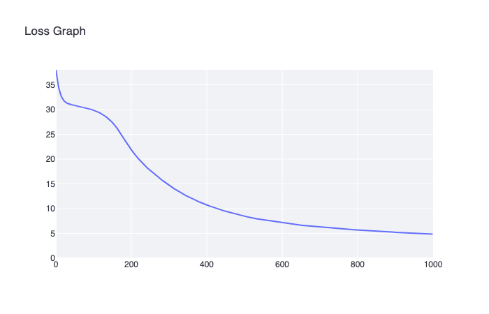
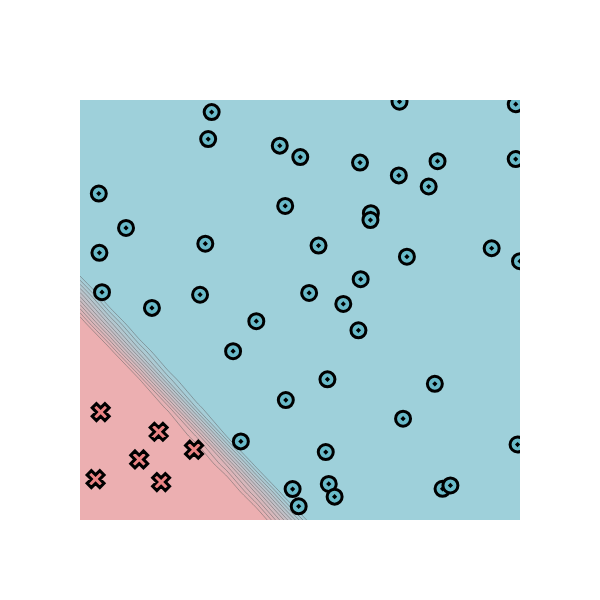
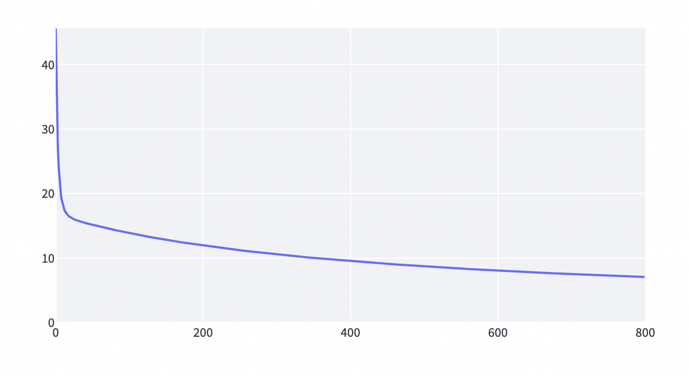
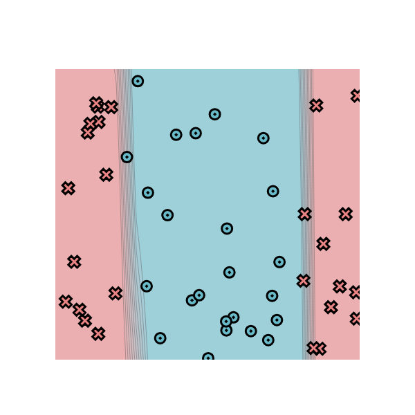
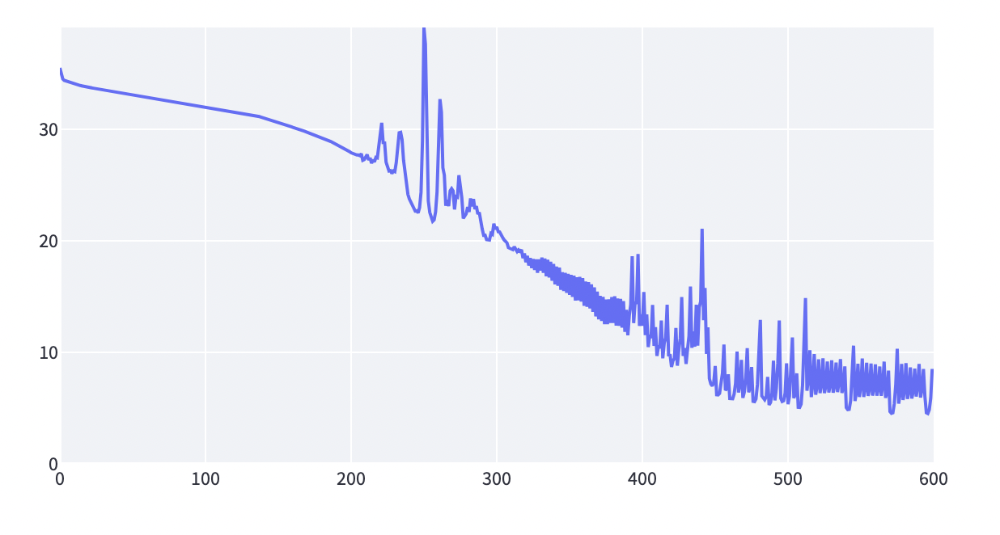
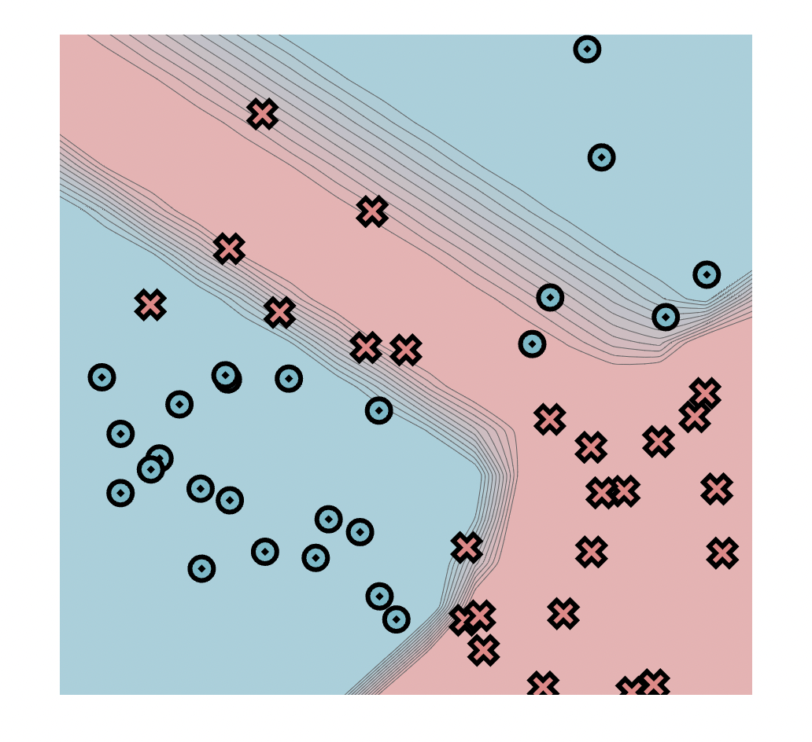
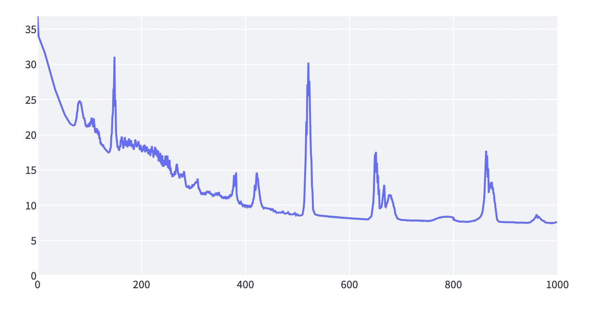

[](https://classroom.github.com/a/4jfBqlei)
[](https://classroom.github.com/online_ide?assignment_repo_id=12053256&assignment_repo_type=AssignmentRepo)
# MiniTorch Module 2


* Docs: https://minitorch.github.io/

* Overview: https://minitorch.github.io/module2/module2/

This assignment requires the following files from the previous assignments. You can get these by running

```bash
python sync_previous_module.py previous-module-dir current-module-dir
```

The files that will be synced are:

        minitorch/operators.py minitorch/module.py minitorch/autodiff.py minitorch/scalar.py minitorch/module.py project/run_manual.py project/run_scalar.py


## Task 2.5 Training Results
### Dataset 1: Simple
Parameters:
|  Hidden Layer Size  | Learning Rate  | Epoches |
|  ----  | ----  | ----  |
| 2  | 0.1 | 1000 |

Result:

Time per epoch: 0.065s.

Final accuracy: 98%, 49/50.


Loss:



Training Logs:

```
Epoch: 0/1200, loss: 0, correct: 0
Epoch: 10/1200, loss: 37.08983109216735, correct: 14
Epoch: 20/1200, loss: 36.4452448315689, correct: 17
Epoch: 30/1200, loss: 35.82951664050733, correct: 19
Epoch: 40/1200, loss: 35.23648674855686, correct: 21
Epoch: 50/1200, loss: 34.663070783340544, correct: 27
Epoch: 60/1200, loss: 34.10758392726534, correct: 32
Epoch: 70/1200, loss: 33.568979386291886, correct: 34
Epoch: 80/1200, loss: 33.046503499658826, correct: 34
Epoch: 90/1200, loss: 32.53954011621643, correct: 35
Epoch: 100/1200, loss: 32.0475407239293, correct: 35
Epoch: 110/1200, loss: 31.569993319741975, correct: 36
Epoch: 120/1200, loss: 31.10640871126743, correct: 38
Epoch: 130/1200, loss: 30.65631461251242, correct: 40
Epoch: 140/1200, loss: 30.219253185621923, correct: 40
Epoch: 150/1200, loss: 29.79478007408573, correct: 41
Epoch: 160/1200, loss: 29.382464053805457, correct: 41
Epoch: 170/1200, loss: 28.981886915530055, correct: 42
Epoch: 180/1200, loss: 28.592643411022053, correct: 42
Epoch: 190/1200, loss: 28.214341193196272, correct: 43
Epoch: 200/1200, loss: 27.84660072390653, correct: 43
Epoch: 210/1200, loss: 27.489055142040122, correct: 44
Epoch: 220/1200, loss: 27.141350092627686, correct: 45
Epoch: 230/1200, loss: 26.8031435208545, correct: 46
Epoch: 240/1200, loss: 26.47410543589308, correct: 46
Epoch: 250/1200, loss: 26.15391764958366, correct: 46
Epoch: 260/1200, loss: 25.842273494711257, correct: 46
Epoch: 270/1200, loss: 25.538877527206555, correct: 46
Epoch: 280/1200, loss: 25.243445216138568, correct: 46
Epoch: 290/1200, loss: 24.95570262491543, correct: 46
Epoch: 300/1200, loss: 24.67538608668449, correct: 46
Epoch: 310/1200, loss: 24.402241876531413, correct: 46
Epoch: 320/1200, loss: 24.136025882721825, correct: 46
Epoch: 330/1200, loss: 23.87650327890769, correct: 46
Epoch: 340/1200, loss: 23.62344819893148, correct: 47
Epoch: 350/1200, loss: 23.376643415604445, correct: 48
Epoch: 360/1200, loss: 23.135880024605676, correct: 48
Epoch: 370/1200, loss: 22.90095713444636, correct: 48
Epoch: 380/1200, loss: 22.671681563265043, correct: 48
Epoch: 390/1200, loss: 22.447867543062983, correct: 48
Epoch: 400/1200, loss: 22.229336431851912, correct: 48
Epoch: 410/1200, loss: 22.015916434067616, correct: 48
Epoch: 420/1200, loss: 21.80744232949938, correct: 48
Epoch: 430/1200, loss: 21.60375521089708, correct: 48
Epoch: 440/1200, loss: 21.4047022303415, correct: 48
Epoch: 450/1200, loss: 21.21013635439859, correct: 48
Epoch: 460/1200, loss: 21.019916128024278, correct: 48
Epoch: 470/1200, loss: 20.833905447139813, correct: 49
Epoch: 480/1200, loss: 20.651973339760236, correct: 49
Epoch: 490/1200, loss: 20.473993755526458, correct: 49
Epoch: 500/1200, loss: 20.29984536346668, correct: 49
Epoch: 510/1200, loss: 20.129411357791902, correct: 49
Epoch: 520/1200, loss: 19.96257927151512, correct: 49
Epoch: 530/1200, loss: 19.79924079767091, correct: 49
Epoch: 540/1200, loss: 19.63929161790427, correct: 49
Epoch: 550/1200, loss: 19.48263123819124, correct: 49
Epoch: 560/1200, loss: 19.329162831450123, correct: 49
Epoch: 570/1200, loss: 19.178793086801416, correct: 49
Epoch: 580/1200, loss: 19.03143206523409, correct: 49
Epoch: 590/1200, loss: 18.886993061438172, correct: 49
Epoch: 600/1200, loss: 18.745392471566173, correct: 49
Epoch: 610/1200, loss: 18.606549666689926, correct: 49
Epoch: 620/1200, loss: 18.470386871724067, correct: 49
Epoch: 630/1200, loss: 18.33682904959281, correct: 49
Epoch: 640/1200, loss: 18.205803790422447, correct: 49
Epoch: 650/1200, loss: 18.077241205548155, correct: 49
Epoch: 660/1200, loss: 17.951073826130298, correct: 49
Epoch: 670/1200, loss: 17.82723650618189, correct: 49
Epoch: 680/1200, loss: 17.705666329816065, correct: 49
Epoch: 690/1200, loss: 17.586302522528676, correct: 49
Epoch: 700/1200, loss: 17.469086366338505, correct: 49
Epoch: 710/1200, loss: 17.353961118614134, correct: 49
Epoch: 720/1200, loss: 17.240871934423105, correct: 49
Epoch: 730/1200, loss: 17.12976579224604, correct: 49
Epoch: 740/1200, loss: 17.020591422904328, correct: 49
Epoch: 750/1200, loss: 16.913299241556807, correct: 49
Epoch: 760/1200, loss: 16.80784128262666, correct: 49
Epoch: 770/1200, loss: 16.70417113752601, correct: 49
Epoch: 780/1200, loss: 16.60224389505119, correct: 49
Epoch: 790/1200, loss: 16.502016084327668, correct: 49
Epoch: 800/1200, loss: 16.403445620188613, correct: 49
Epoch: 810/1200, loss: 16.306491750876507, correct: 49
Epoch: 820/1200, loss: 16.211115007962356, correct: 49
Epoch: 830/1200, loss: 16.11727715838144, correct: 49
Epoch: 840/1200, loss: 16.024941158489753, correct: 49
Epoch: 850/1200, loss: 15.93407111004912, correct: 49
Epoch: 860/1200, loss: 15.844632218053798, correct: 49
Epoch: 870/1200, loss: 15.75659075031493, correct: 49
Epoch: 880/1200, loss: 15.669913998723496, correct: 49
Epoch: 890/1200, loss: 15.584570242115891, correct: 49
Epoch: 900/1200, loss: 15.500528710669967, correct: 49
Epoch: 910/1200, loss: 15.417759551762611, correct: 49
Epoch: 920/1200, loss: 15.336233797223324, correct: 49
Epoch: 930/1200, loss: 15.255923331921284, correct: 49
Epoch: 940/1200, loss: 15.176800863626292, correct: 49
Epoch: 950/1200, loss: 15.098839894086845, correct: 49
Epoch: 960/1200, loss: 15.022014691271213, correct: 49
Epoch: 970/1200, loss: 14.946300262720234, correct: 49
Epoch: 980/1200, loss: 14.871672329962154, correct: 49
Epoch: 990/1200, loss: 14.798107303943427, correct: 49
Epoch: 1000/1200, loss: 14.725582261430288, correct: 49
Epoch: 1010/1200, loss: 14.654074922338925, correct: 49
Epoch: 1020/1200, loss: 14.583563627953545, correct: 49
Epoch: 1030/1200, loss: 14.514027319993938, correct: 49
Epoch: 1040/1200, loss: 14.445445520495484, correct: 49
Epoch: 1050/1200, loss: 14.377798312466682, correct: 49
Epoch: 1060/1200, loss: 14.311066321290701, correct: 49
Epoch: 1070/1200, loss: 14.245230696839002, correct: 49
Epoch: 1080/1200, loss: 14.1802730962667, correct: 49
Epoch: 1090/1200, loss: 14.116175667460533, correct: 49
Epoch: 1100/1200, loss: 14.052921033111941, correct: 49
Epoch: 1110/1200, loss: 13.990492275388576, correct: 49
Epoch: 1120/1200, loss: 13.92887292117941, correct: 49
Epoch: 1130/1200, loss: 13.868046927889107, correct: 49
Epoch: 1140/1200, loss: 13.807998669758812, correct: 49
Epoch: 1150/1200, loss: 13.748712924691585, correct: 49
Epoch: 1160/1200, loss: 13.690174861561413, correct: 49
Epoch: 1170/1200, loss: 13.632370027985939, correct: 49
Epoch: 1180/1200, loss: 13.575284338543806, correct: 49
Epoch: 1190/1200, loss: 13.518904063418494, correct: 49
Epoch: 1200/1200, loss: 13.46321581745123, correct: 49
```

### Dataset 2: Diag
Parameters:
|  Hidden Layer Size  | Learning Rate  | Epoches |
|  ----  | ----  | ----  |
| 2  | 0.5 | 800 |

Result:

Time per epoch: 0.065s.

Final accuracy: 96%, 48/50.




Loss:




Training Logs:

```
Epoch: 10/800, loss: 18.50561090052458, correct: 43
Epoch: 20/800, loss: 16.371725281576673, correct: 43
Epoch: 30/800, loss: 15.815784342169076, correct: 43
Epoch: 40/800, loss: 15.469357382383254, correct: 43
Epoch: 50/800, loss: 15.170641693571689, correct: 43
Epoch: 60/800, loss: 14.891048193386206, correct: 43
Epoch: 70/800, loss: 14.62431812149512, correct: 43
Epoch: 80/800, loss: 14.368640075114342, correct: 43
Epoch: 90/800, loss: 14.123173136956133, correct: 43
Epoch: 100/800, loss: 13.887312257547938, correct: 43
Epoch: 110/800, loss: 13.66052764697995, correct: 43
Epoch: 120/800, loss: 13.442329075141837, correct: 43
Epoch: 130/800, loss: 13.232257395634159, correct: 43
Epoch: 140/800, loss: 13.02988177683507, correct: 43
Epoch: 150/800, loss: 12.834798006483188, correct: 43
Epoch: 160/800, loss: 12.646626954560418, correct: 43
Epoch: 170/800, loss: 12.465013060764507, correct: 43
Epoch: 180/800, loss: 12.289622854573697, correct: 43
Epoch: 190/800, loss: 12.120143528777952, correct: 43
Epoch: 200/800, loss: 11.956281580116034, correct: 43
Epoch: 210/800, loss: 11.797761523660434, correct: 43
Epoch: 220/800, loss: 11.644324683120743, correct: 43
Epoch: 230/800, loss: 11.49572805662193, correct: 43
Epoch: 240/800, loss: 11.351743256008827, correct: 43
Epoch: 250/800, loss: 11.212155516862955, correct: 43
Epoch: 260/800, loss: 11.076762775927671, correct: 43
Epoch: 270/800, loss: 10.945374812379377, correct: 43
Epoch: 280/800, loss: 10.81781244927328, correct: 43
Epoch: 290/800, loss: 10.69390681148219, correct: 43
Epoch: 300/800, loss: 10.573498636505681, correct: 43
Epoch: 310/800, loss: 10.456437634631783, correct: 43
Epoch: 320/800, loss: 10.342581895070557, correct: 44
Epoch: 330/800, loss: 10.231797334835816, correct: 44
Epoch: 340/800, loss: 10.123957187320999, correct: 44
Epoch: 350/800, loss: 10.018941527690314, correct: 44
Epoch: 360/800, loss: 9.916636832383533, correct: 44
Epoch: 370/800, loss: 9.816935570207313, correct: 44
Epoch: 380/800, loss: 9.719735822656595, correct: 44
Epoch: 390/800, loss: 9.624940931273718, correct: 44
Epoch: 400/800, loss: 9.532459170009874, correct: 44
Epoch: 410/800, loss: 9.442203440702285, correct: 45
Epoch: 420/800, loss: 9.354090989920833, correct: 45
Epoch: 430/800, loss: 9.268043145569736, correct: 45
Epoch: 440/800, loss: 9.183985071752778, correct: 45
Epoch: 450/800, loss: 9.101845540525753, correct: 46
Epoch: 460/800, loss: 9.021556719266089, correct: 46
Epoch: 470/800, loss: 8.943053972488881, correct: 46
Epoch: 480/800, loss: 8.866275677029927, correct: 47
Epoch: 490/800, loss: 8.79116304960103, correct: 47
Epoch: 500/800, loss: 8.717659985801085, correct: 47
Epoch: 510/800, loss: 8.645712909738135, correct: 47
Epoch: 520/800, loss: 8.575270633484292, correct: 47
Epoch: 530/800, loss: 8.506284225646155, correct: 47
Epoch: 540/800, loss: 8.438706888389687, correct: 47
Epoch: 550/800, loss: 8.372493842310096, correct: 47
Epoch: 560/800, loss: 8.307602218584694, correct: 47
Epoch: 570/800, loss: 8.243990957890452, correct: 47
Epoch: 580/800, loss: 8.18162071560787, correct: 47
Epoch: 590/800, loss: 8.120453772869862, correct: 47
Epoch: 600/800, loss: 8.060453953047928, correct: 47
Epoch: 610/800, loss: 8.001586543299219, correct: 47
Epoch: 620/800, loss: 7.943818220826585, correct: 47
Epoch: 630/800, loss: 7.887116983529936, correct: 47
Epoch: 640/800, loss: 7.831452084751523, correct: 47
Epoch: 650/800, loss: 7.776793971839829, correct: 47
Epoch: 660/800, loss: 7.723114228277291, correct: 47
Epoch: 670/800, loss: 7.6703855191359, correct: 47
Epoch: 680/800, loss: 7.618581539641894, correct: 47
Epoch: 690/800, loss: 7.5676769666468875, correct: 47
Epoch: 700/800, loss: 7.517647412817339, correct: 47
Epoch: 710/800, loss: 7.468469383367837, correct: 47
Epoch: 720/800, loss: 7.420120235176146, correct: 47
Epoch: 730/800, loss: 7.372578138129492, correct: 47
Epoch: 740/800, loss: 7.32582203856213, correct: 47
Epoch: 750/800, loss: 7.27983162465412, correct: 47
Epoch: 760/800, loss: 7.2345872936701765, correct: 47
Epoch: 770/800, loss: 7.190070120925976, correct: 47
Epoch: 780/800, loss: 7.146261830376842, correct: 47
Epoch: 790/800, loss: 7.103144766731094, correct: 48
Epoch: 800/800, loss: 7.0607018689967935, correct: 48
```

### Dataset 3: Split
Parameters:
|  Hidden Layer Size  | Learning Rate  | Epoches |
|  ----  | ----  | ----  |
| 4  | 0.5 | 600 |

Result:

Time per epoch: 0.242s.

Final accuracy: 94%, 47/50.



Loss:



Training Logs:

```
Epoch: 0/600, loss: 0, correct: 0
Epoch: 10/600, loss: 34.06685250418475, correct: 28
Epoch: 20/600, loss: 33.78179588822306, correct: 27
Epoch: 30/600, loss: 33.55378700655431, correct: 31
Epoch: 40/600, loss: 33.315836406759814, correct: 31
Epoch: 50/600, loss: 33.08143046442627, correct: 32
Epoch: 60/600, loss: 32.859845276501176, correct: 31
Epoch: 70/600, loss: 32.648520706424186, correct: 30
Epoch: 80/600, loss: 32.45125066804971, correct: 30
Epoch: 90/600, loss: 32.254083309991906, correct: 29
Epoch: 100/600, loss: 32.05565070529927, correct: 30
Epoch: 110/600, loss: 31.85256593660366, correct: 31
Epoch: 120/600, loss: 31.634743794242468, correct: 31
Epoch: 130/600, loss: 31.395649533265658, correct: 31
Epoch: 140/600, loss: 31.06807716453863, correct: 32
Epoch: 150/600, loss: 30.660795252846967, correct: 32
Epoch: 160/600, loss: 30.234806870510603, correct: 33
Epoch: 170/600, loss: 29.78121877586566, correct: 33
Epoch: 180/600, loss: 29.301584429124848, correct: 33
Epoch: 190/600, loss: 28.725397764623125, correct: 31
Epoch: 200/600, loss: 27.994138032468076, correct: 35
Epoch: 210/600, loss: 27.28094169524367, correct: 37
Epoch: 220/600, loss: 28.36086462925382, correct: 39
Epoch: 230/600, loss: 26.264832781013197, correct: 42
Epoch: 240/600, loss: 24.160831984095687, correct: 43
Epoch: 250/600, loss: 29.017397992440507, correct: 33
Epoch: 260/600, loss: 24.40004917747073, correct: 39
Epoch: 270/600, loss: 24.686818271934786, correct: 38
Epoch: 280/600, loss: 22.42536519270801, correct: 39
Epoch: 290/600, loss: 21.507435703956542, correct: 40
Epoch: 300/600, loss: 21.05582820639456, correct: 39
Epoch: 310/600, loss: 19.35101169304349, correct: 39
Epoch: 320/600, loss: 18.871215659032814, correct: 39
Epoch: 330/600, loss: 18.33757968578244, correct: 39
Epoch: 340/600, loss: 17.92184259799816, correct: 40
Epoch: 350/600, loss: 17.03516614019354, correct: 42
Epoch: 360/600, loss: 16.654439903454815, correct: 43
Epoch: 370/600, loss: 15.444719950465881, correct: 44
Epoch: 380/600, loss: 14.964039107906109, correct: 44
Epoch: 390/600, loss: 13.815609869483579, correct: 44
Epoch: 400/600, loss: 13.412790681721983, correct: 44
Epoch: 410/600, loss: 12.264877688124727, correct: 45
Epoch: 420/600, loss: 9.818836975907686, correct: 46
Epoch: 430/600, loss: 10.384333358044191, correct: 46
Epoch: 440/600, loss: 14.029273835931594, correct: 44
Epoch: 450/600, loss: 7.306502439933825, correct: 47
Epoch: 460/600, loss: 8.029813415792473, correct: 48
Epoch: 470/600, loss: 5.917013016692797, correct: 47
Epoch: 480/600, loss: 7.108816233652948, correct: 48
Epoch: 490/600, loss: 6.357248733595597, correct: 47
Epoch: 500/600, loss: 9.016670358533789, correct: 47
Epoch: 510/600, loss: 5.368883393444696, correct: 48
Epoch: 520/600, loss: 6.207614076890963, correct: 48
Epoch: 530/600, loss: 7.079333082786044, correct: 47
Epoch: 540/600, loss: 8.740508665898261, correct: 47
Epoch: 550/600, loss: 5.999340640852905, correct: 48
Epoch: 560/600, loss: 6.762608934328369, correct: 47
Epoch: 570/600, loss: 8.360440070570954, correct: 47
Epoch: 580/600, loss: 5.724960272797616, correct: 48
Epoch: 590/600, loss: 6.914255140176502, correct: 46
Epoch: 600/600, loss: 8.516771803773619, correct: 47

```

### Dataset 4: Xor
Parameters:
|  Hidden Layer Size  | Learning Rate  | Epoches |
|  ----  | ----  | ----  |
| 6  | 0.5 | 1000 |

Result:

Time per epoch: 0.391s.

Final accuracy: 92%, 46/50.




Loss:



Training Logs:

```
Epoch: 0/500, loss: 0, correct: 0
Epoch: 10/1000, loss: 32.71408244634999, correct: 29
Epoch: 20/1000, loss: 30.164032045590226, correct: 34
Epoch: 30/1000, loss: 27.555652968596114, correct: 37
Epoch: 40/1000, loss: 25.271634208974948, correct: 40
Epoch: 50/1000, loss: 23.413017755457616, correct: 40
Epoch: 60/1000, loss: 21.911327634900243, correct: 38
Epoch: 70/1000, loss: 21.335703519525715, correct: 41
Epoch: 80/1000, loss: 24.689047127590438, correct: 40
Epoch: 90/1000, loss: 22.26433042248172, correct: 40
Epoch: 100/1000, loss: 21.130165832018292, correct: 40
Epoch: 110/1000, loss: 21.27315359174184, correct: 40
Epoch: 120/1000, loss: 19.409877883037005, correct: 40
Epoch: 130/1000, loss: 18.06597157460164, correct: 40
Epoch: 140/1000, loss: 17.65681560762745, correct: 40
Epoch: 150/1000, loss: 23.991434432747067, correct: 40
Epoch: 160/1000, loss: 18.20194351648369, correct: 41
Epoch: 170/1000, loss: 18.418359061251923, correct: 41
Epoch: 180/1000, loss: 18.847581037094468, correct: 41
Epoch: 190/1000, loss: 18.85099890646515, correct: 41
Epoch: 200/1000, loss: 18.16475857785221, correct: 41
Epoch: 210/1000, loss: 17.66880249900611, correct: 41
Epoch: 220/1000, loss: 17.488072801834267, correct: 41
Epoch: 230/1000, loss: 17.033956941864968, correct: 41
Epoch: 240/1000, loss: 15.706556980452028, correct: 41
Epoch: 250/1000, loss: 15.62322506023251, correct: 41
Epoch: 260/1000, loss: 14.158917176914645, correct: 41
Epoch: 270/1000, loss: 14.877353562802492, correct: 41
Epoch: 280/1000, loss: 14.08225301053229, correct: 41
Epoch: 290/1000, loss: 12.557052669010643, correct: 44
Epoch: 300/1000, loss: 12.824710959499738, correct: 41
Epoch: 310/1000, loss: 12.951941000019083, correct: 44
Epoch: 320/1000, loss: 11.573600177574773, correct: 46
Epoch: 330/1000, loss: 11.783152083827941, correct: 45
Epoch: 340/1000, loss: 11.57385868495172, correct: 44
Epoch: 350/1000, loss: 11.87841414506099, correct: 44
Epoch: 360/1000, loss: 10.956501451895367, correct: 46
Epoch: 370/1000, loss: 11.405532340235865, correct: 44
Epoch: 380/1000, loss: 13.392518876554188, correct: 44
Epoch: 390/1000, loss: 10.14207323914347, correct: 46
Epoch: 400/1000, loss: 9.796846881538299, correct: 46
Epoch: 410/1000, loss: 10.005554786344346, correct: 46
Epoch: 420/1000, loss: 12.069127047692772, correct: 45
Epoch: 430/1000, loss: 10.62276247448358, correct: 46
Epoch: 440/1000, loss: 9.578763012899653, correct: 47
Epoch: 450/1000, loss: 9.267859266683713, correct: 47
Epoch: 460/1000, loss: 8.9394161029843, correct: 47
Epoch: 470/1000, loss: 8.961726644683889, correct: 46
Epoch: 480/1000, loss: 8.834329549862648, correct: 46
Epoch: 490/1000, loss: 8.70892514723479, correct: 47
Epoch: 500/1000, loss: 8.800679844020198, correct: 47
Epoch: 510/1000, loss: 8.617377813827282, correct: 46
Epoch: 520/1000, loss: 27.133616766745238, correct: 38
Epoch: 530/1000, loss: 11.924795317667522, correct: 44
Epoch: 540/1000, loss: 8.60817670955204, correct: 46
Epoch: 550/1000, loss: 8.516665306073929, correct: 46
Epoch: 560/1000, loss: 8.437945906365535, correct: 46
Epoch: 570/1000, loss: 8.372403980638083, correct: 46
Epoch: 580/1000, loss: 8.309734975149409, correct: 46
Epoch: 590/1000, loss: 8.2458319363235, correct: 46
Epoch: 600/1000, loss: 8.186343426990224, correct: 46
Epoch: 610/1000, loss: 8.126444634755826, correct: 46
Epoch: 620/1000, loss: 8.078097771350931, correct: 46
Epoch: 630/1000, loss: 8.031885365400038, correct: 46
Epoch: 640/1000, loss: 8.184650849272188, correct: 46
Epoch: 650/1000, loss: 17.23156997509056, correct: 41
Epoch: 660/1000, loss: 9.546538901006786, correct: 44
Epoch: 670/1000, loss: 9.819148061729916, correct: 44
Epoch: 680/1000, loss: 11.305421996269823, correct: 44
Epoch: 690/1000, loss: 8.69496923884437, correct: 44
Epoch: 700/1000, loss: 7.94083154482458, correct: 46
Epoch: 710/1000, loss: 7.888546424058463, correct: 46
Epoch: 720/1000, loss: 7.845974404371907, correct: 46
Epoch: 730/1000, loss: 7.856489981757062, correct: 46
Epoch: 740/1000, loss: 7.826428523535563, correct: 46
Epoch: 750/1000, loss: 7.797567972900126, correct: 46
Epoch: 760/1000, loss: 7.844287493904855, correct: 46
Epoch: 770/1000, loss: 8.161307595320649, correct: 46
Epoch: 780/1000, loss: 8.33267015235441, correct: 45
Epoch: 790/1000, loss: 8.397834288170579, correct: 45
Epoch: 800/1000, loss: 8.291449907358762, correct: 44
Epoch: 810/1000, loss: 7.728369139611745, correct: 46
Epoch: 820/1000, loss: 7.681192564053928, correct: 46
Epoch: 830/1000, loss: 7.657562688356535, correct: 46
Epoch: 840/1000, loss: 7.792638451500986, correct: 46
Epoch: 850/1000, loss: 8.162697497960904, correct: 45
Epoch: 860/1000, loss: 10.713630342301908, correct: 44
Epoch: 870/1000, loss: 12.35831439319882, correct: 44
Epoch: 880/1000, loss: 10.58953027782586, correct: 44
Epoch: 890/1000, loss: 7.657437785679278, correct: 46
Epoch: 900/1000, loss: 7.615569597118782, correct: 46
Epoch: 910/1000, loss: 7.596037394348578, correct: 46
Epoch: 920/1000, loss: 7.550502624159538, correct: 46
Epoch: 930/1000, loss: 7.529362495857216, correct: 46
Epoch: 940/1000, loss: 7.510393285069385, correct: 46
Epoch: 950/1000, loss: 7.644433240570976, correct: 46
Epoch: 960/1000, loss: 8.44360865121394, correct: 45
Epoch: 970/1000, loss: 7.972507587998109, correct: 45
Epoch: 980/1000, loss: 7.527943080105185, correct: 46
Epoch: 990/1000, loss: 7.473641390341772, correct: 46
Epoch: 1000/1000, loss: 7.648657528949868, correct: 46

```

