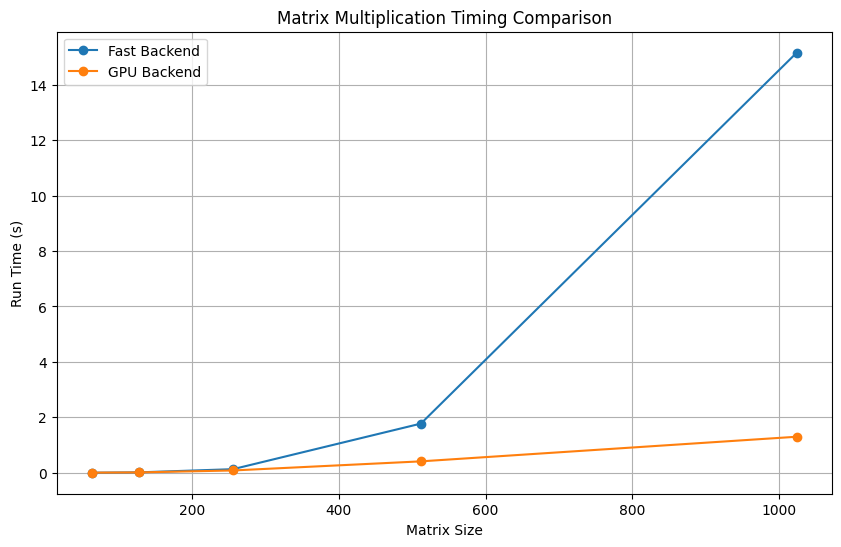

[](https://classroom.github.com/a/vYQ4W4rf)
# MiniTorch Module 3


* Docs: https://minitorch.github.io/

* Overview: https://minitorch.github.io/module3.html


You will need to modify `tensor_functions.py` slightly in this assignment.

* Tests:

```
python run_tests.py
```

* Note:

Several of the tests for this assignment will only run if you are on a GPU machine and will not
run on github's test infrastructure. Please follow the instructions to setup up a colab machine
to run these tests.

This assignment requires the following files from the previous assignments. You can get these by running

```bash
python sync_previous_module.py previous-module-dir current-module-dir
```

The files that will be synced are:

        minitorch/tensor_data.py minitorch/tensor_functions.py minitorch/tensor_ops.py minitorch/operators.py minitorch/module.py minitorch/autodiff.py minitorch/module.py project/run_manual.py project/run_scalar.py project/run_tensor.py

## Task 3.1 Parallel Check

```
(mle) wxn@xuening mle-module-3-Xuening0322 % python3 project/parallel_check.py
MAP
 
================================================================================
 Parallel Accelerator Optimizing:  Function tensor_map.<locals>._map, 
/Users/wxn/Desktop/CS5781/mle-module-3-Xuening0322/minitorch/fast_ops.py (154)  
================================================================================


Parallel loop listing for  Function tensor_map.<locals>._map, /Users/wxn/Desktop/CS5781/mle-module-3-Xuening0322/minitorch/fast_ops.py (154) 
--------------------------------------------------------------------------------------------|loop #ID
    def _map(                                                                               | 
        out: Storage,                                                                       | 
        out_shape: Shape,                                                                   | 
        out_strides: Strides,                                                               | 
        in_storage: Storage,                                                                | 
        in_shape: Shape,                                                                    | 
        in_strides: Strides,                                                                | 
    ) -> None:                                                                              | 
        # TODO: Implement for Task 3.1.                                                     | 
        # if (                                                                              | 
        #     len(out_shape) == len(in_shape)                                               | 
        #     and (out_shape == in_shape).all()                                             | 
        #     and (out_strides == in_strides).all()                                         | 
        # ):                                                                                | 
        #     for ordinal in prange(len(out)):                                              | 
        #         out[ordinal] = fn(in_storage[ordinal])                                    | 
        #     return                                                                        | 
                                                                                            | 
        # for out_ordinal in prange(len(out)):                                              | 
        #     # Get the index of a particular output                                        | 
        #     out_index = out_shape.copy()                                                  | 
        #     to_index(out_ordinal, out_shape, out_index)                                   | 
                                                                                            | 
        #     # Broadcast that index to the index in the input                              | 
        #     in_index = in_shape.copy()                                                    | 
        #     broadcast_index(out_index, out_shape, in_shape, in_index)                     | 
                                                                                            | 
        #     # Apply the function to the input at that space and store it in the output    | 
        #     in_ordinal = index_to_position(in_index, in_strides)                          | 
        #     out[out_ordinal] = fn(in_storage[in_ordinal])                                 | 
                                                                                            | 
        for i in prange(len(out)):----------------------------------------------------------| #2
            out_index: Index = np.zeros(MAX_DIMS, np.int16)---------------------------------| #0
            in_index: Index = np.zeros(MAX_DIMS, np.int16)----------------------------------| #1
            to_index(i, out_shape, out_index)                                               | 
            broadcast_index(out_index, out_shape, in_shape, in_index)                       | 
            o = index_to_position(out_index, out_strides)                                   | 
            j = index_to_position(in_index, in_strides)                                     | 
            out[o] = fn(in_storage[j])                                                      | 
--------------------------------- Fusing loops ---------------------------------
Attempting fusion of parallel loops (combines loops with similar properties)...
Following the attempted fusion of parallel for-loops there are 3 parallel for-
loop(s) (originating from loops labelled: #2, #0, #1).
--------------------------------------------------------------------------------
---------------------------- Optimising loop nests -----------------------------
Attempting loop nest rewrites (optimising for the largest parallel loops)...
 
+--2 is a parallel loop
   +--0 --> rewritten as a serial loop
   +--1 --> rewritten as a serial loop
--------------------------------------------------------------------------------
----------------------------- Before Optimisation ------------------------------
Parallel region 0:
+--2 (parallel)
   +--0 (parallel)
   +--1 (parallel)


--------------------------------------------------------------------------------
------------------------------ After Optimisation ------------------------------
Parallel region 0:
+--2 (parallel)
   +--0 (serial)
   +--1 (serial)


 
Parallel region 0 (loop #2) had 0 loop(s) fused and 2 loop(s) serialized as part
 of the larger parallel loop (#2).
--------------------------------------------------------------------------------
--------------------------------------------------------------------------------
 
---------------------------Loop invariant code motion---------------------------
Allocation hoisting:
The memory allocation derived from the instruction at 
/Users/wxn/Desktop/CS5781/mle-module-3-Xuening0322/minitorch/fast_ops.py (186) 
is hoisted out of the parallel loop labelled #2 (it will be performed before the
 loop is executed and reused inside the loop):
   Allocation:: out_index: Index = np.zeros(MAX_DIMS, np.int16)
    - numpy.empty() is used for the allocation.
The memory allocation derived from the instruction at 
/Users/wxn/Desktop/CS5781/mle-module-3-Xuening0322/minitorch/fast_ops.py (187) 
is hoisted out of the parallel loop labelled #2 (it will be performed before the
 loop is executed and reused inside the loop):
   Allocation:: in_index: Index = np.zeros(MAX_DIMS, np.int16)
    - numpy.empty() is used for the allocation.
None
ZIP
 
================================================================================
 Parallel Accelerator Optimizing:  Function tensor_zip.<locals>._zip, 
/Users/wxn/Desktop/CS5781/mle-module-3-Xuening0322/minitorch/fast_ops.py (219)  
================================================================================


Parallel loop listing for  Function tensor_zip.<locals>._zip, /Users/wxn/Desktop/CS5781/mle-module-3-Xuening0322/minitorch/fast_ops.py (219) 
------------------------------------------------------------------------------------------------|loop #ID
    def _zip(                                                                                   | 
        out: Storage,                                                                           | 
        out_shape: Shape,                                                                       | 
        out_strides: Strides,                                                                   | 
        a_storage: Storage,                                                                     | 
        a_shape: Shape,                                                                         | 
        a_strides: Strides,                                                                     | 
        b_storage: Storage,                                                                     | 
        b_shape: Shape,                                                                         | 
        b_strides: Strides,                                                                     | 
    ) -> None:                                                                                  | 
        # When `out`, `a`, `b` are stride-aligned, avoid indexing                               | 
        if (                                                                                    | 
            len(out_shape) == len(a_shape)                                                      | 
            and len(out_shape) == len(b_shape)                                                  | 
            and (out_shape == a_shape).all()----------------------------------------------------| #3
            and (out_shape == b_shape).all()----------------------------------------------------| #4
            and (out_strides == a_strides).all()------------------------------------------------| #5
            and (out_strides == b_strides).all()------------------------------------------------| #6
        ):                                                                                      | 
            assert (out_shape == a_shape).all() and (out_shape == b_shape).all()----------------| #7, 8
            for ordinal in prange(len(out)):----------------------------------------------------| #12
                out[ordinal] = fn(a_storage[ordinal], b_storage[ordinal])                       | 
            return                                                                              | 
        # TODO: Implement for Task 3.1.                                                         | 
        # for out_ordinal in prange(len(out)):                                                  | 
        #     # Get the index of a particular output                                            | 
        #     out_index = out_shape.copy()                                                      | 
        #     to_index(out_ordinal, out_shape, out_index)                                       | 
                                                                                                | 
        #     # Broadcast that index to the index in each input                                 | 
        #     a_index = a_shape.copy()                                                          | 
        #     b_index = b_shape.copy()                                                          | 
        #     broadcast_index(out_index, out_shape, a_shape, a_index)                           | 
        #     broadcast_index(out_index, out_shape, b_shape, b_index)                           | 
                                                                                                | 
        #     # Apply the function to the inputs at that space and store it in the output       | 
        #     a_ordinal = index_to_position(a_index, a_strides)                                 | 
        #     b_ordinal = index_to_position(b_index, b_strides)                                 | 
        #     out[out_ordinal] = fn(a_storage[a_ordinal], b_storage[b_ordinal])                 | 
        for out_i in prange(len(out)):----------------------------------------------------------| #13
            out_index = np.zeros(MAX_DIMS, np.int32)--------------------------------------------| #9
            to_index(out_i, out_shape, out_index)                                               | 
            a_index, b_index = (                                                                | 
                np.zeros(MAX_DIMS, np.int32),---------------------------------------------------| #10
                np.zeros(MAX_DIMS, np.int32),---------------------------------------------------| #11
            )                                                                                   | 
            broadcast_index(out_index, out_shape, a_shape, a_index)                             | 
            broadcast_index(out_index, out_shape, b_shape, b_index)                             | 
            a_position, b_position = (                                                          | 
                index_to_position(a_index, a_strides),                                          | 
                index_to_position(b_index, b_strides),                                          | 
            )                                                                                   | 
            out_position = index_to_position(out_index, out_strides)                            | 
            out[out_position] = fn(a_storage[a_position], b_storage[b_position])                | 
--------------------------------- Fusing loops ---------------------------------
Attempting fusion of parallel loops (combines loops with similar properties)...
 
Fused loop summary:
+--10 has the following loops fused into it:
   +--11 (fused)
Following the attempted fusion of parallel for-loops there are 9 parallel for-
loop(s) (originating from loops labelled: #3, #4, #5, #6, #7, #8, #12, #13, #9).
--------------------------------------------------------------------------------
---------------------------- Optimising loop nests -----------------------------
Attempting loop nest rewrites (optimising for the largest parallel loops)...
 
+--13 is a parallel loop
   +--9 --> rewritten as a serial loop
   +--10 --> rewritten as a serial loop
--------------------------------------------------------------------------------
----------------------------- Before Optimisation ------------------------------
Parallel region 0:
+--13 (parallel)
   +--9 (parallel)
   +--10 (parallel)
   +--11 (parallel)


--------------------------------------------------------------------------------
------------------------------ After Optimisation ------------------------------
Parallel region 0:
+--13 (parallel)
   +--9 (serial)
   +--10 (serial, fused with loop(s): 11)


 
Parallel region 0 (loop #13) had 1 loop(s) fused and 2 loop(s) serialized as 
part of the larger parallel loop (#13).
--------------------------------------------------------------------------------
--------------------------------------------------------------------------------
 
---------------------------Loop invariant code motion---------------------------
Allocation hoisting:
The memory allocation derived from the instruction at 
/Users/wxn/Desktop/CS5781/mle-module-3-Xuening0322/minitorch/fast_ops.py (263) 
is hoisted out of the parallel loop labelled #13 (it will be performed before 
the loop is executed and reused inside the loop):
   Allocation:: np.zeros(MAX_DIMS, np.int32),
    - numpy.empty() is used for the allocation.
The memory allocation derived from the instruction at 
/Users/wxn/Desktop/CS5781/mle-module-3-Xuening0322/minitorch/fast_ops.py (264) 
is hoisted out of the parallel loop labelled #13 (it will be performed before 
the loop is executed and reused inside the loop):
   Allocation:: np.zeros(MAX_DIMS, np.int32),
    - numpy.empty() is used for the allocation.
The memory allocation derived from the instruction at 
/Users/wxn/Desktop/CS5781/mle-module-3-Xuening0322/minitorch/fast_ops.py (260) 
is hoisted out of the parallel loop labelled #13 (it will be performed before 
the loop is executed and reused inside the loop):
   Allocation:: out_index = np.zeros(MAX_DIMS, np.int32)
    - numpy.empty() is used for the allocation.
None
REDUCE
 
================================================================================
 Parallel Accelerator Optimizing:  Function tensor_reduce.<locals>._reduce, 
/Users/wxn/Desktop/CS5781/mle-module-3-Xuening0322/minitorch/fast_ops.py (297)  
================================================================================


Parallel loop listing for  Function tensor_reduce.<locals>._reduce, /Users/wxn/Desktop/CS5781/mle-module-3-Xuening0322/minitorch/fast_ops.py (297) 
-----------------------------------------------------------------------------------------|loop #ID
    def _reduce(                                                                         | 
        out: Storage,                                                                    | 
        out_shape: Shape,                                                                | 
        out_strides: Strides,                                                            | 
        a_storage: Storage,                                                              | 
        a_shape: Shape,                                                                  | 
        a_strides: Strides,                                                              | 
        reduce_dim: int,                                                                 | 
    ) -> None:                                                                           | 
        # TODO: Implement for Task 3.1.                                                  | 
        # # Main loop in parallel                                                        | 
        # for i in prange(len(out)):                                                     | 
        #     # All indices use numpy buffers                                            | 
        #     out_index: Index = np.zeros_like(out_shape, dtype=np.int32)                | 
        #     # The index of out[i]                                                      | 
        #     to_index(i, out_shape, out_index)                                          | 
        #     # The starting position in a to be reduced                                 | 
        #     a_ordinal = index_to_position(out_index, a_strides)                        | 
        #     # Initialize the reduced value of a[i]                                     | 
        #     reduced_val = out[i]                                                       | 
        #     # Inner-loop should not call any functions or write non-local variables    | 
        #     for j in prange(a_shape[reduce_dim]):                                      | 
        #         # Calculate the reduced value of a[i]                                  | 
        #         reduced_val = fn(                                                      | 
        #             reduced_val,                                                       | 
        #             a_storage[a_ordinal + j * a_strides[reduce_dim]],                  | 
        #         )                                                                      | 
        #     # Put the reduced data into out                                            | 
        #     out[i] = reduced_val                                                       | 
        # total_elements = np.prod(out_shape)                                            | 
                                                                                         | 
        out_index: Index = np.zeros(MAX_DIMS, np.int32)----------------------------------| #14
        reduce_size = a_shape[reduce_dim]                                                | 
        for i in range(len(out)):                                                        | 
            to_index(i, out_shape, out_index)                                            | 
            o = index_to_position(out_index, out_strides)                                | 
            for s in range(reduce_size):                                                 | 
                out_index[reduce_dim] = s                                                | 
                j = index_to_position(out_index, a_strides)                              | 
                out[o] = fn(out[o], a_storage[j])                                        | 
--------------------------------- Fusing loops ---------------------------------
Attempting fusion of parallel loops (combines loops with similar properties)...
Following the attempted fusion of parallel for-loops there are 1 parallel for-
loop(s) (originating from loops labelled: #14).
--------------------------------------------------------------------------------
----------------------------- Before Optimisation ------------------------------
--------------------------------------------------------------------------------
------------------------------ After Optimisation ------------------------------
Parallel structure is already optimal.
--------------------------------------------------------------------------------
--------------------------------------------------------------------------------
 
---------------------------Loop invariant code motion---------------------------
Allocation hoisting:
No allocation hoisting found
None
MATRIX MULTIPLY
 
================================================================================
 Parallel Accelerator Optimizing:  Function _tensor_matrix_multiply, 
/Users/wxn/Desktop/CS5781/mle-module-3-Xuening0322/minitorch/fast_ops.py (341)  
================================================================================


Parallel loop listing for  Function _tensor_matrix_multiply, /Users/wxn/Desktop/CS5781/mle-module-3-Xuening0322/minitorch/fast_ops.py (341) 
-----------------------------------------------------------------------------------------|loop #ID
def _tensor_matrix_multiply(                                                             | 
    out: Storage,                                                                        | 
    out_shape: Shape,                                                                    | 
    out_strides: Strides,                                                                | 
    a_storage: Storage,                                                                  | 
    a_shape: Shape,                                                                      | 
    a_strides: Strides,                                                                  | 
    b_storage: Storage,                                                                  | 
    b_shape: Shape,                                                                      | 
    b_strides: Strides,                                                                  | 
) -> None:                                                                               | 
    """                                                                                  | 
    NUMBA tensor matrix multiply function.                                               | 
                                                                                         | 
    Should work for any tensor shapes that broadcast as long as                          | 
                                                                                         | 
    ```                                                                                  | 
    assert a_shape[-1] == b_shape[-2]                                                    | 
    ```                                                                                  | 
                                                                                         | 
    Optimizations:                                                                       | 
                                                                                         | 
    * Outer loop in parallel                                                             | 
    * No index buffers or function calls                                                 | 
    * Inner loop should have no global writes, 1 multiply.                               | 
                                                                                         | 
                                                                                         | 
    Args:                                                                                | 
        out (Storage): storage for `out` tensor                                          | 
        out_shape (Shape): shape for `out` tensor                                        | 
        out_strides (Strides): strides for `out` tensor                                  | 
        a_storage (Storage): storage for `a` tensor                                      | 
        a_shape (Shape): shape for `a` tensor                                            | 
        a_strides (Strides): strides for `a` tensor                                      | 
        b_storage (Storage): storage for `b` tensor                                      | 
        b_shape (Shape): shape for `b` tensor                                            | 
        b_strides (Strides): strides for `b` tensor                                      | 
                                                                                         | 
    Returns:                                                                             | 
        None : Fills in `out`                                                            | 
    """                                                                                  | 
    a_batch_stride = a_strides[0] if a_shape[0] > 1 else 0                               | 
    b_batch_stride = b_strides[0] if b_shape[0] > 1 else 0                               | 
                                                                                         | 
    # TODO: Implement for Task 3.2.                                                      | 
    # raise NotImplementedError("Need to implement for Task 3.2")                        | 
    # for i1 in prange(out_shape[0]):                                                    | 
    #     for i2 in prange(out_shape[1]):                                                | 
    #         for i3 in prange(out_shape[2]):                                            | 
    #             a_inner = i1 * a_batch_stride + i2 * a_strides[1]                      | 
    #             b_inner = i1 * b_batch_stride + i3 * b_strides[2]                      | 
    #             acc = 0.0                                                              | 
    #             for _ in range(a_shape[2]):                                            | 
    #                 acc += a_storage[a_inner] * b_storage[b_inner]                     | 
    #                 a_inner += a_strides[2]                                            | 
    #                 b_inner += b_strides[1]                                            | 
    #             out_position = (                                                       | 
    #                 i1 * out_strides[0] + i2 * out_strides[1] + i3 * out_strides[2]    | 
    #             )                                                                      | 
    #             out[out_position] = acc                                                | 
                                                                                         | 
    assert a_shape[-1] == b_shape[-2]                                                    | 
                                                                                         | 
    for pos in prange(len(out)):---------------------------------------------------------| #15
        out_index_0 = pos // (out_shape[-1] * out_shape[-2])                             | 
        out_index_1 = (pos % (out_shape[-1] * out_shape[-2])) // out_shape[-1]           | 
        out_index_2 = pos % out_shape[-1]                                                | 
                                                                                         | 
        out_position = (                                                                 | 
            out_index_0 * out_strides[0]                                                 | 
            + out_index_1 * out_strides[1]                                               | 
            + out_index_2 * out_strides[2]                                               | 
        )                                                                                | 
                                                                                         | 
        a_start = out_index_0 * a_batch_stride + out_index_1 * a_strides[1]              | 
        b_start = out_index_0 * b_batch_stride + out_index_2 * b_strides[2]              | 
                                                                                         | 
        result = 0                                                                       | 
        for position in range(a_shape[-1]):                                              | 
            result += (                                                                  | 
                a_storage[a_start + position * a_strides[2]]                             | 
                * b_storage[b_start + position * b_strides[1]]                           | 
            )                                                                            | 
        out[out_position] = result                                                       | 
--------------------------------- Fusing loops ---------------------------------
Attempting fusion of parallel loops (combines loops with similar properties)...
Following the attempted fusion of parallel for-loops there are 1 parallel for-
loop(s) (originating from loops labelled: #15).
--------------------------------------------------------------------------------
----------------------------- Before Optimisation ------------------------------
--------------------------------------------------------------------------------
------------------------------ After Optimisation ------------------------------
Parallel structure is already optimal.
--------------------------------------------------------------------------------
--------------------------------------------------------------------------------
 
---------------------------Loop invariant code motion---------------------------
Allocation hoisting:
No allocation hoisting found
None
```


## Task 3.4 CUDA Matrix Multiplication



## Task 3.5 Training Results


## 3.5 Log

Simple Dataset GPU Hidden 100 Learning Rate 0.1

```plaintext
Epoch  0  loss  10.364424317735956 correct 27 time per epoch 0.5412566184997558
Epoch  10  loss  7.093833193176547 correct 36 time per epoch 1.973733949661255
Epoch  20  loss  4.073888978638485 correct 44 time per epoch 1.9534459114074707
Epoch  30  loss  1.9945549117859047 correct 49 time per epoch 1.9819812536239625
Epoch  40  loss  1.8331705198797128 correct 48 time per epoch 1.979853630065918
Epoch  50  loss  2.0315235000388316 correct 49 time per epoch 1.979233717918396
Epoch  60  loss  1.1283229190392141 correct 49 time per epoch 1.9828200578689574
Epoch  70  loss  1.2785158061227182 correct 46 time per epoch 1.9650386333465577
Epoch  80  loss  0.3143364951308766 correct 49 time per epoch 1.9548640727996827
Epoch  90  loss  0.7809262120091209 correct 49 time per epoch 1.9668348789215089
Epoch  100  loss  1.6328091036095251 correct 49 time per epoch 1.990393614768982
Epoch  110  loss  2.7507224590523176 correct 49 time per epoch 1.9665771961212157
Epoch  120  loss  1.997171085178991 correct 48 time per epoch 2.0229782819747926
Epoch  130  loss  0.4240352312421902 correct 46 time per epoch 2.000909996032715
Epoch  140  loss  0.48544083391662035 correct 48 time per epoch 2.0141309261322022
Epoch  150  loss  0.24829486921150257 correct 45 time per epoch 2.03162362575531
Epoch  160  loss  0.2484179414681856 correct 50 time per epoch 1.9993688821792603
Epoch  170  loss  1.3029879923274839 correct 47 time per epoch 1.9913733959198
Epoch  180  loss  1.7693699385618287 correct 46 time per epoch 1.9952744483947753
Epoch  190  loss  0.8499854057727082 correct 49 time per epoch 1.991558814048767
Epoch  200  loss  0.08559038992892183 correct 49 time per epoch 1.970328950881958
Epoch  210  loss  1.2302262266970339 correct 47 time per epoch 1.9749064683914184
Epoch  220  loss  0.28379523317299016 correct 49 time per epoch 1.990970993041992
Epoch  230  loss  2.217514914712411 correct 50 time per epoch 1.9938210010528565
Epoch  240  loss  1.849078797690188 correct 47 time per epoch 1.9849586963653565
Epoch  250  loss  0.4540633372149132 correct 50 time per epoch 1.9831653833389282
Epoch  260  loss  1.7089401187601356 correct 46 time per epoch 2.006126308441162
Epoch  270  loss  0.17273633270287508 correct 47 time per epoch 1.9821624517440797
Epoch  280  loss  0.6088516555969965 correct 48 time per epoch 1.9454344511032104
Epoch  290  loss  0.4757496891835593 correct 50 time per epoch 1.9809430599212647
Epoch  300  loss  0.6290422477015841 correct 50 time per epoch 1.9605098009109496
Epoch  310  loss  0.2384748106547897 correct 50 time per epoch 2.0096401453018187
Epoch  320  loss  0.5794321341890415 correct 47 time per epoch 1.9793944120407105
Epoch  330  loss  0.897775442239158 correct 50 time per epoch 1.971427035331726
Epoch  340  loss  0.49279159455337485 correct 50 time per epoch 1.986142873764038
Epoch  350  loss  0.13045393429789526 correct 48 time per epoch 1.9871490001678467
Epoch  360  loss  0.08127643865030514 correct 49 time per epoch 1.9813647985458374
Epoch  370  loss  0.3086797332878289 correct 50 time per epoch 1.9576026678085328
Epoch  380  loss  0.04001681264948541 correct 50 time per epoch 1.9410420179367065
Epoch  390  loss  0.8503301119622206 correct 48 time per epoch 1.9648675918579102
Epoch  400  loss  0.042859754930453006 correct 50 time per epoch 1.943948221206665
Epoch  410  loss  1.2752233989031745 correct 50 time per epoch 1.9686755895614625
Epoch  420  loss  0.9307028351683313 correct 50 time per epoch 1.9618432521820068
Epoch  430  loss  0.039136729678382914 correct 50 time per epoch 1.9828822374343873
Epoch  440  loss  0.07659172635143524 correct 50 time per epoch 1.9657983541488648
Epoch  450  loss  0.29635005068586484 correct 50 time per epoch 1.9854960203170777
Epoch  460  loss  2.0863878977822194 correct 48 time per epoch 1.976006555557251
Epoch  470  loss  1.0674666415550664 correct 49 time per epoch 1.9475427389144897
Epoch  480  loss  0.03368173660890048 correct 49 time per epoch 1.9644976615905763
Epoch  490  loss  1.1289539796791752 correct 47 time per epoch 1.9614028453826904
```

Simple Dataset CPU Learning Rate 0.05

```plaintext
/bin/bash: line 1: cd: mle-module-3-LexiYin-mh: No such file or directory
Epoch  0  loss  4.10926197941144 correct 44 time per epoch 3.01634624004364
Epoch  10  loss  0.9756085483065831 correct 50 time per epoch 0.21821682453155516
Epoch  20  loss  0.9049420069422931 correct 50 time per epoch 0.11187036037445068
Epoch  30  loss  0.3927636833569059 correct 50 time per epoch 0.1127553939819336
Epoch  40  loss  0.5162113795385994 correct 50 time per epoch 0.11073684692382812
Epoch  50  loss  0.7670630599281382 correct 50 time per epoch 0.11166377067565918
Epoch  60  loss  0.2639796544426144 correct 50 time per epoch 0.11455025672912597
Epoch  70  loss  0.44451096749093755 correct 50 time per epoch 0.1134380578994751
Epoch  80  loss  0.1396084733288001 correct 50 time per epoch 0.11425082683563233
Epoch  90  loss  0.3451199401342981 correct 50 time per epoch 0.11143016815185547
Epoch  100  loss  0.03412588655111644 correct 50 time per epoch 0.12449562549591064
Epoch  110  loss  0.1892366725569414 correct 50 time per epoch 0.15275356769561768
Epoch  120  loss  0.2983494763200317 correct 50 time per epoch 0.15173742771148682
Epoch  130  loss  0.18073463113206217 correct 50 time per epoch 0.18432095050811767
Epoch  140  loss  0.14940840386754273 correct 50 time per epoch 0.33687686920166016
Epoch  150  loss  0.10576627658514681 correct 50 time per epoch 0.28967506885528566
Epoch  160  loss  0.16853957711440948 correct 50 time per epoch 0.2768852949142456
Epoch  170  loss  0.24434019207346586 correct 50 time per epoch 0.13536088466644286
Epoch  180  loss  0.19568524369000273 correct 50 time per epoch 0.11323955059051513
Epoch  190  loss  0.1241867240283134 correct 50 time per epoch 0.11508922576904297
Epoch  200  loss  0.0992889049426969 correct 50 time per epoch 0.11264348030090332
Epoch  210  loss  0.16456990646656572 correct 50 time per epoch 0.11283187866210938
Epoch  220  loss  0.02486310208378082 correct 50 time per epoch 0.11294019222259521
Epoch  230  loss  0.08914586907143236 correct 50 time per epoch 0.11553747653961181
Epoch  240  loss  0.12964729883185616 correct 50 time per epoch 0.1135481834411621
Epoch  250  loss  0.03982403954301339 correct 50 time per epoch 0.11542489528656005
Epoch  260  loss  0.09111355730376813 correct 50 time per epoch 0.15038058757781983
Epoch  270  loss  0.19435086775348756 correct 50 time per epoch 0.15005204677581788
Epoch  280  loss  0.03374889905877438 correct 50 time per epoch 0.14783284664154053
Epoch  290  loss  0.034689499584429864 correct 50 time per epoch 0.2838082551956177
Epoch  300  loss  0.05952856390983933 correct 50 time per epoch 0.2853676795959473
Epoch  310  loss  0.01185746964357306 correct 50 time per epoch 0.2458934783935547
Epoch  320  loss  0.10213253921767981 correct 50 time per epoch 0.21300129890441893
Epoch  330  loss  0.019910710839472108 correct 50 time per epoch 0.11254487037658692
Epoch  340  loss  0.00040279261366393056 correct 50 time per epoch 0.1128880500793457
Epoch  350  loss  0.006168758551435909 correct 50 time per epoch 0.11023306846618652
Epoch  360  loss  0.056100338636664644 correct 50 time per epoch 0.11569681167602539
Epoch  370  loss  0.06767727961112388 correct 50 time per epoch 0.11895139217376709
Epoch  380  loss  0.10682414781938371 correct 50 time per epoch 0.11509497165679931
Epoch  390  loss  0.03995694352110874 correct 50 time per epoch 0.11010546684265136
Epoch  400  loss  0.01765850047854098 correct 50 time per epoch 0.11429195404052735
Epoch  410  loss  0.039695083320153514 correct 50 time per epoch 0.12503595352172853
Epoch  420  loss  0.057835835460220274 correct 50 time per epoch 0.15441110134124755
Epoch  430  loss  0.013986433507190263 correct 50 time per epoch 0.14789354801177979
Epoch  440  loss  0.015793177884735363 correct 50 time per epoch 0.18471939563751222
Epoch  450  loss  0.03591282528979164 correct 50 time per epoch 0.293087100982666
Epoch  460  loss  0.0013612166144798131 correct 50 time per epoch 0.2963066101074219
Epoch  470  loss  0.02133519889734006 correct 50 time per epoch 0.2996145486831665
Epoch  480  loss  0.0038838175581913203 correct 50 time per epoch 0.12925324440002442
Epoch  490  loss  0.01254502353909508 correct 50 time per epoch 0.10866241455078125
```

Split Dataset GPU Learning Rate 0.05

```plaintext
Epoch  0  loss  5.932508444552064 correct 38 time per epoch 0.42576329708099364
Epoch  10  loss  6.324334274294333 correct 39 time per epoch 1.9573039054870605
Epoch  20  loss  5.821370508241222 correct 40 time per epoch 1.9481407165527345
Epoch  30  loss  3.915066879899211 correct 39 time per epoch 1.9261980772018432
Epoch  40  loss  2.10947413784003 correct 38 time per epoch 1.9534743547439575
Epoch  50  loss  3.440821950946389 correct 48 time per epoch 1.9240219831466674
Epoch  60  loss  3.737059037960431 correct 48 time per epoch 1.931515383720398
Epoch  70  loss  5.283563747971535 correct 47 time per epoch 1.9351534605026246
Epoch  80  loss  1.9538098584889427 correct 50 time per epoch 1.923025631904602
Epoch  90  loss  1.0202301543071497 correct 48 time per epoch 1.9168849229812621
Epoch  100  loss  1.2021463341016352 correct 49 time per epoch 1.9249568700790405
Epoch  110  loss  1.4373055976706401 correct 50 time per epoch 1.9138418674468993
Epoch  120  loss  3.0221955284721327 correct 46 time per epoch 1.9227754592895507
Epoch  130  loss  0.6138194919569889 correct 50 time per epoch 1.958083939552307
Epoch  140  loss  1.9896908148529378 correct 49 time per epoch 1.9640882968902589
Epoch  150  loss  1.0754224010383875 correct 50 time per epoch 1.9635018110275269
Epoch  160  loss  0.8854437748971838 correct 49 time per epoch 1.9675861120223999
Epoch  170  loss  0.7364698329092292 correct 50 time per epoch 1.9289087295532226
Epoch  180  loss  2.72929088108927 correct 48 time per epoch 1.9223691463470458
Epoch  190  loss  0.9882768015462656 correct 50 time per epoch 1.9418344974517823
Epoch  200  loss  0.38662265070813007 correct 50 time per epoch 1.9412042617797851
Epoch  210  loss  0.18687172885492398 correct 49 time per epoch 1.952162504196167
Epoch  220  loss  0.24203542057986902 correct 49 time per epoch 1.9482574701309203
Epoch  230  loss  0.2698793910127036 correct 50 time per epoch 1.950764775276184
Epoch  240  loss  0.7940383289815537 correct 49 time per epoch 1.9312301635742188
Epoch  250  loss  1.248649734634431 correct 50 time per epoch 1.915231204032898
Epoch  260  loss  0.08588156634026799 correct 50 time per epoch 1.9335442304611206
Epoch  270  loss  0.34295291113707216 correct 50 time per epoch 1.920425534248352
Epoch  280  loss  0.11993114479503904 correct 50 time per epoch 1.9076627731323241
Epoch  290  loss  0.43440407529228015 correct 50 time per epoch 1.9473052740097045
Epoch  300  loss  0.3529094092367624 correct 50 time per epoch 1.9308908462524415
Epoch  310  loss  1.014744960357264 correct 50 time per epoch 1.9342320442199707
Epoch  320  loss  0.17264060822981442 correct 50 time per epoch 1.9029265880584716
Epoch  330  loss  0.27038159941893697 correct 49 time per epoch 1.9438982248306274
Epoch  340  loss  0.20824429615517862 correct 50 time per epoch 1.94166738986969
Epoch  350  loss  0.8743106200089189 correct 50 time per epoch 1.910373592376709
Epoch  360  loss  0.1931709203024639 correct 50 time per epoch 1.9140954256057738
Epoch  370  loss  0.5141994503643115 correct 50 time per epoch 1.921948003768921
Epoch  380  loss  0.07975879222965478 correct 50 time per epoch 1.9347219944000245
Epoch  390  loss  0.5422026761343302 correct 49 time per epoch 1.9351180791854858
Epoch  400  loss  0.05193690158022906 correct 50 time per epoch 1.9327617645263673
Epoch  410  loss  0.6255810725802791 correct 50 time per epoch 1.9135746479034423
Epoch  420  loss  0.43863176164901696 correct 49 time per epoch 1.9232139348983766
Epoch  430  loss  0.4541637274947121 correct 50 time per epoch 1.947970414161682
Epoch  440  loss  0.2844467680603251 correct 50 time per epoch 1.9213755130767822
Epoch  450  loss  0.8707377937676511 correct 50 time per epoch 1.9427565813064576
Epoch  460  loss  0.2321581207926316 correct 50 time per epoch 1.936022162437439
Epoch  470  loss  0.12381162766915423 correct 50 time per epoch 1.9397255897521972
Epoch  480  loss  0.1572268235908196 correct 50 time per epoch 1.938994550704956
Epoch  490  loss  0.2648130860682665 correct 50 time per epoch 1.9276463747024537
```

Split Dataset CPU Learning Rate 0.05

```plaintext
Epoch  0  loss  6.911151819920211 correct 33 time per epoch 3.522884798049927
Epoch  10  loss  6.404772121071184 correct 40 time per epoch 0.11417582035064697
Epoch  20  loss  5.2674819183202874 correct 42 time per epoch 0.11284184455871582
Epoch  30  loss  4.90595639227901 correct 42 time per epoch 0.10935425758361816
Epoch  40  loss  3.9067408600463187 correct 43 time per epoch 0.1168264627456665
Epoch  50  loss  3.5021730317748565 correct 45 time per epoch 0.10863873958587647
Epoch  60  loss  2.422427577158343 correct 44 time per epoch 0.11892013549804688
Epoch  70  loss  1.84561698469846 correct 46 time per epoch 0.15345959663391112
Epoch  80  loss  2.322239714183854 correct 47 time per epoch 0.14915452003479004
Epoch  90  loss  1.7870185108638497 correct 47 time per epoch 0.14839704036712648
Epoch  100  loss  1.10985862234705 correct 48 time per epoch 0.28722543716430665
Epoch  110  loss  3.5426321660351303 correct 47 time per epoch 0.28105342388153076
Epoch  120  loss  1.7896253532796813 correct 50 time per epoch 0.24835898876190185
Epoch  130  loss  1.9284359901504338 correct 49 time per epoch 0.22748658657073975
Epoch  140  loss  1.0726401427097667 correct 48 time per epoch 0.10933635234832764
Epoch  150  loss  1.866659956455594 correct 49 time per epoch 0.10982017517089844
Epoch  160  loss  0.9622341861749666 correct 50 time per epoch 0.11510679721832276
Epoch  170  loss  1.4401194216835433 correct 50 time per epoch 0.11369061470031738
Epoch  180  loss  1.2267610283401216 correct 49 time per epoch 0.1102412462234497
Epoch  190  loss  1.5229371443725805 correct 49 time per epoch 0.1107609748840332
Epoch  200  loss  2.486777232979724 correct 49 time per epoch 0.10958919525146485
Epoch  210  loss  0.3085740128335512 correct 49 time per epoch 0.11340537071228027
Epoch  220  loss  1.6074411092436551 correct 49 time per epoch 0.1377582311630249
Epoch  230  loss  0.6447927909754512 correct 50 time per epoch 0.1543271780014038
Epoch  240  loss  0.9580598580887603 correct 50 time per epoch 0.207090163230896
Epoch  250  loss  0.997296893155421 correct 50 time per epoch 0.2526918649673462
Epoch  260  loss  1.035364697783449 correct 50 time per epoch 0.25318911075592043
Epoch  270  loss  0.6359002459775169 correct 50 time per epoch 0.2888155937194824
Epoch  280  loss  0.8128948998181641 correct 49 time per epoch 0.24174134731292723
Epoch  290  loss  0.10222224015039902 correct 50 time per epoch 0.1121145248413086
Epoch  300  loss  0.7270755843371844 correct 50 time per epoch 0.11078107357025146
Epoch  310  loss  0.339226965159494 correct 50 time per epoch 0.11865167617797852
Epoch  320  loss  0.7615612439321439 correct 50 time per epoch 0.11365201473236083
Epoch  330  loss  0.25226206657088796 correct 50 time per epoch 0.11478028297424317
Epoch  340  loss  1.1607578070367603 correct 50 time per epoch 0.11322360038757324
Epoch  350  loss  1.0542032060440674 correct 50 time per epoch 0.11558091640472412
Epoch  360  loss  0.9127793458012408 correct 50 time per epoch 0.11244099140167237
Epoch  370  loss  0.8548903180192405 correct 50 time per epoch 0.15876080989837646
Epoch  380  loss  0.9512275658943367 correct 50 time per epoch 0.1527027368545532
Epoch  390  loss  0.6509029758139315 correct 50 time per epoch 0.1510854721069336
Epoch  400  loss  0.17891995307059622 correct 50 time per epoch 0.23670401573181152
Epoch  410  loss  0.6181194042652108 correct 50 time per epoch 0.2971816539764404
Epoch  420  loss  0.42151234472818644 correct 50 time per epoch 0.2945887088775635
Epoch  430  loss  0.20834964627400274 correct 50 time per epoch 0.25391695499420164
Epoch  440  loss  0.5476325508051745 correct 50 time per epoch 0.11487686634063721
Epoch  450  loss  0.47536876421035157 correct 50 time per epoch 0.1118821382522583
Epoch  460  loss  0.2991055780398124 correct 50 time per epoch 0.11132829189300537
Epoch  470  loss  0.04866092174394873 correct 50 time per epoch 0.11265430450439454
Epoch  480  loss  0.21421722651210762 correct 50 time per epoch 0.11239757537841796
Epoch  490  loss  0.32383632519459016 correct 50 time per epoch 0.11287260055541992
```

Xor Dataset GPU Learning rate 0.1

```plaintext
Epoch  0  loss  6.57418467824419 correct 31 time per epoch 0.4025981903076172
Epoch  10  loss  3.877963795774763 correct 46 time per epoch 1.924561357498169
Epoch  20  loss  3.8044918262328435 correct 42 time per epoch 1.9332531929016112
Epoch  30  loss  2.6541488888718145 correct 47 time per epoch 1.9306171655654907
Epoch  40  loss  1.9804362897191627 correct 49 time per epoch 1.9526620149612426
Epoch  50  loss  2.302964029211725 correct 48 time per epoch 1.9477798700332642
Epoch  60  loss  1.3808646589691063 correct 48 time per epoch 1.9657091617584228
Epoch  70  loss  1.5735656952093822 correct 48 time per epoch 1.9651602268218995
Epoch  80  loss  0.24479512825135108 correct 48 time per epoch 1.9223216772079468
Epoch  90  loss  0.22803006589141112 correct 48 time per epoch 1.9421643257141112
Epoch  100  loss  1.5333236193067443 correct 49 time per epoch 1.9282585620880126
Epoch  110  loss  1.341990950922521 correct 50 time per epoch 1.9210352182388306
Epoch  120  loss  1.7843302599314985 correct 49 time per epoch 1.9217677116394043
Epoch  130  loss  1.265371155960075 correct 48 time per epoch 1.9127827882766724
Epoch  140  loss  0.18395154623053753 correct 48 time per epoch 1.9234105110168458
Epoch  150  loss  0.11624228632852306 correct 48 time per epoch 1.912353801727295
Epoch  160  loss  0.054642860982167675 correct 48 time per epoch 1.9064531087875367
Epoch  170  loss  1.2820945753274038 correct 49 time per epoch 1.8977981567382813
Epoch  180  loss  0.7277573090297741 correct 49 time per epoch 1.8815796613693236
Epoch  190  loss  0.08609595556518593 correct 50 time per epoch 1.8914588212966919
Epoch  200  loss  0.28748902515387176 correct 49 time per epoch 1.877386784553528
Epoch  210  loss  0.4202882308004225 correct 48 time per epoch 1.926999568939209
Epoch  220  loss  0.5911200545082752 correct 50 time per epoch 1.8925877332687377
Epoch  230  loss  0.766738920475718 correct 49 time per epoch 1.8968047618865966
Epoch  240  loss  0.0958478795154115 correct 50 time per epoch 1.9065787553787232
Epoch  250  loss  0.4346532440144103 correct 50 time per epoch 1.900465226173401
Epoch  260  loss  0.12553518839896516 correct 48 time per epoch 1.8719635963439942
Epoch  270  loss  0.5025552921141215 correct 50 time per epoch 1.8918449401855468
Epoch  280  loss  0.37008705870076813 correct 50 time per epoch 1.8874949216842651
Epoch  290  loss  0.6752022851419225 correct 50 time per epoch 1.9345475673675536
Epoch  300  loss  0.3631280082423839 correct 48 time per epoch 1.9234384536743163
Epoch  310  loss  0.05492905825289672 correct 50 time per epoch 1.9004838705062865
Epoch  320  loss  0.009531415048439008 correct 50 time per epoch 1.9279305458068847
Epoch  330  loss  0.14508240409021575 correct 50 time per epoch 1.9308643817901612
Epoch  340  loss  0.3106112178674241 correct 50 time per epoch 1.9093464612960815
Epoch  350  loss  0.3674509374079525 correct 50 time per epoch 1.9320694208145142
Epoch  360  loss  0.2697380381707576 correct 50 time per epoch 1.8873974561691285
Epoch  370  loss  0.1429987163251625 correct 50 time per epoch 1.9405124187469482
Epoch  380  loss  0.09705205634710042 correct 50 time per epoch 1.9297426700592042
Epoch  390  loss  0.3341537240738689 correct 50 time per epoch 1.9296008825302124
Epoch  400  loss  0.18102851601378636 correct 50 time per epoch 1.9180485963821412
Epoch  410  loss  0.0013671222689134847 correct 49 time per epoch 1.9310896158218385
Epoch  420  loss  0.27405014489126867 correct 50 time per epoch 1.9043078899383545
Epoch  430  loss  0.33897860559195303 correct 50 time per epoch 1.9125683784484864
Epoch  440  loss  0.32999889324276427 correct 50 time per epoch 1.9025377988815309
Epoch  450  loss  0.03397325357992442 correct 50 time per epoch 1.9233413219451905
Epoch  460  loss  0.03100552268710623 correct 50 time per epoch 1.912795066833496
Epoch  470  loss  0.09317019167539639 correct 50 time per epoch 1.9002310514450074
Epoch  480  loss  0.3432282748085853 correct 50 time per epoch 1.9006242990493774
Epoch  490  loss  0.34990122685509967 correct 50 time per epoch 1.9014860391616821
```

Xor Dataset CPU Learning rate 0.05

```plaintext
Epoch  0  loss  6.714801909790763 correct 44 time per epoch 2.971043825149536
Epoch  10  loss  4.267249951198997 correct 46 time per epoch 0.2954816102981567
Epoch  20  loss  3.9871076015874145 correct 47 time per epoch 0.1953573703765869
Epoch  30  loss  2.519176890365342 correct 47 time per epoch 0.11408565044403077
Epoch  40  loss  3.36984439361866 correct 49 time per epoch 0.1379699468612671
Epoch  50  loss  3.417756200119149 correct 48 time per epoch 0.15892176628112792
Epoch  60  loss  1.0531580197422032 correct 48 time per epoch 0.11069564819335938
Epoch  70  loss  2.05612053919748 correct 48 time per epoch 0.1145007848739624
Epoch  80  loss  0.6253458025427628 correct 49 time per epoch 0.11146626472473145
Epoch  90  loss  1.724315290192617 correct 48 time per epoch 0.11477129459381104
Epoch  100  loss  3.044607158763638 correct 49 time per epoch 0.13284776210784913
Epoch  110  loss  1.01171929664192 correct 49 time per epoch 0.15071773529052734
Epoch  120  loss  0.28679279446705924 correct 49 time per epoch 0.14965803623199464
Epoch  130  loss  3.131100991822536 correct 47 time per epoch 0.15479824542999268
Epoch  140  loss  2.5487548354004392 correct 49 time per epoch 0.25642006397247313
Epoch  150  loss  1.3263775875304595 correct 49 time per epoch 0.29785563945770266
Epoch  160  loss  0.8432938550351513 correct 49 time per epoch 0.23485879898071288
Epoch  170  loss  0.8205480891476123 correct 49 time per epoch 0.2206550121307373
Epoch  180  loss  1.292218356130277 correct 49 time per epoch 0.11281230449676513
Epoch  190  loss  0.4511060968731216 correct 49 time per epoch 0.11262280941009521
Epoch  200  loss  0.2936083474872655 correct 49 time per epoch 0.10942964553833008
Epoch  210  loss  0.8637058513659248 correct 49 time per epoch 0.11211633682250977
Epoch  220  loss  2.26543692888311 correct 50 time per epoch 0.11219861507415771
Epoch  230  loss  0.13837765489085807 correct 49 time per epoch 0.11180076599121094
Epoch  240  loss  0.5142378079624611 correct 49 time per epoch 0.1121206283569336
Epoch  250  loss  0.6759127644290054 correct 49 time per epoch 0.1128995180130005
Epoch  260  loss  1.7645799488804708 correct 50 time per epoch 0.13546133041381836
Epoch  270  loss  0.4138467503621926 correct 49 time per epoch 0.15371851921081542
Epoch  280  loss  0.15847191262532845 correct 50 time per epoch 0.18611080646514894
Epoch  290  loss  0.9262218996064487 correct 50 time per epoch 0.2525531053543091
Epoch  300  loss  0.5726633423948311 correct 50 time per epoch 0.2983780145645142
Epoch  310  loss  1.4572341509449658 correct 49 time per epoch 0.2982564210891724
Epoch  320  loss  0.39683531084818413 correct 50 time per epoch 0.23327198028564453
Epoch  330  loss  0.4043140355738523 correct 49 time per epoch 0.11053524017333985
Epoch  340  loss  0.21145174229404073 correct 50 time per epoch 0.11209499835968018
Epoch  350  loss  0.07312605971994025 correct 50 time per epoch 0.1109956979751587
Epoch  360  loss  0.8638087110925571 correct 49 time per epoch 0.11145229339599609
Epoch  370  loss  0.20297550784748636 correct 49 time per epoch 0.11940879821777343
Epoch  380  loss  0.020081885065145178 correct 50 time per epoch 0.11314215660095214
Epoch  390  loss  0.10152547084420036 correct 49 time per epoch 0.11358139514923096
Epoch  400  loss  0.49784566435260014 correct 50 time per epoch 0.11038658618927003
Epoch  410  loss  0.20888388923584134 correct 50 time per epoch 0.1342763662338257
Epoch  420  loss  0.5897406353539528 correct 50 time per epoch 0.14880771636962892
Epoch  430  loss  0.24972416328294342 correct 50 time per epoch 0.15081548690795898
Epoch  440  loss  0.37228044292181994 correct 49 time per epoch 0.15146880149841307
Epoch  450  loss  0.681270781008449 correct 50 time per epoch 0.28969488143920896
Epoch  460  loss  0.5267444397759448 correct 50 time per epoch 0.23176910877227783
Epoch  470  loss  0.28000427596951 correct 50 time per epoch 0.19754834175109864
Epoch  480  loss  0.48556733376178424 correct 50 time per epoch 0.2544827938079834
Epoch  490  loss  0.7163493842954556 correct 50 time per epoch 0.11018106937408448
```

### 3.5 Larger Hidden

Simple Dataset GPU Hidden 200 with Learning Rate 0.01

```plaintext
Epoch  0  loss  2.9936911729079636 correct 41 time per epoch 0.43923933506011964
Epoch  10  loss  1.181138170075137 correct 48 time per epoch 1.9865998029708862
Epoch  20  loss  1.4209611476186843 correct 48 time per epoch 2.0021630048751833
Epoch  30  loss  1.111531660812846 correct 49 time per epoch 1.975070858001709
Epoch  40  loss  0.3295066368920897 correct 49 time per epoch 2.0003112316131593
Epoch  50  loss  0.6093457540284866 correct 49 time per epoch 1.9841365814208984
Epoch  60  loss  0.41372227138500867 correct 50 time per epoch 1.996376895904541
Epoch  70  loss  0.7620761129947349 correct 49 time per epoch 2.004842209815979
Epoch  80  loss  1.0308990306011347 correct 49 time per epoch 2.0062570571899414
Epoch  90  loss  0.5609950430249406 correct 49 time per epoch 2.0122790336608887
Epoch  100  loss  0.2652026748406342 correct 48 time per epoch 1.992853617668152
Epoch  110  loss  0.7688880350049243 correct 50 time per epoch 1.9913926362991332
Epoch  120  loss  0.06257397057106776 correct 49 time per epoch 1.9925752401351928
Epoch  130  loss  0.4696010744466632 correct 48 time per epoch 1.9881833076477051
Epoch  140  loss  0.1689433947401993 correct 49 time per epoch 1.9923406839370728
Epoch  150  loss  0.25216636900795675 correct 49 time per epoch 2.0186717987060545
Epoch  160  loss  0.5985826681383427 correct 50 time per epoch 2.0428231239318846
Epoch  170  loss  0.512002100126386 correct 50 time per epoch 2.028063702583313
Epoch  180  loss  0.7065921662492658 correct 49 time per epoch 2.034644055366516
Epoch  190  loss  0.6044486761020016 correct 49 time per epoch 2.017035961151123
Epoch  200  loss  1.2664628154873852 correct 49 time per epoch 2.0105396270751954
Epoch  210  loss  1.6222161842533143 correct 49 time per epoch 1.9845489740371705
Epoch  220  loss  0.5010195655669982 correct 50 time per epoch 1.9704902410507201
Epoch  230  loss  1.9643758904005426 correct 49 time per epoch 1.9990881204605102
Epoch  240  loss  2.880067932413411 correct 49 time per epoch 1.9855253458023072
Epoch  250  loss  0.7480246248240339 correct 50 time per epoch 1.9843370199203492
Epoch  260  loss  0.040692695340279694 correct 50 time per epoch 1.9935646057128906
Epoch  270  loss  0.3112824363815574 correct 50 time per epoch 1.9798865795135498
Epoch  280  loss  1.3874653832653963 correct 49 time per epoch 1.9831186294555665
Epoch  290  loss  0.1866744083197899 correct 50 time per epoch 1.9955065488815307
Epoch  300  loss  0.4114896489980279 correct 50 time per epoch 1.9879004955291748
Epoch  310  loss  0.9423532885817681 correct 49 time per epoch 2.0167507886886598
Epoch  320  loss  0.08267845539811186 correct 50 time per epoch 2.0124799489974974
Epoch  330  loss  0.44317002438443476 correct 50 time per epoch 1.9963905811309814
Epoch  340  loss  0.4427563370529192 correct 49 time per epoch 1.9854684114456176
Epoch  350  loss  0.04741288263480215 correct 50 time per epoch 1.9978100776672363
Epoch  360  loss  0.8582440100992668 correct 50 time per epoch 2.0365150928497315
Epoch  370  loss  0.6284927929122702 correct 49 time per epoch 1.992987322807312
Epoch  380  loss  2.0485028821670115 correct 49 time per epoch 2.021094226837158
Epoch  390  loss  0.287456195307735 correct 50 time per epoch 1.9863295316696168
Epoch  400  loss  0.7151173491892955 correct 50 time per epoch 2.005589747428894
Epoch  410  loss  0.16306979733006927 correct 50 time per epoch 1.9948057651519775
Epoch  420  loss  0.7163492962073235 correct 49 time per epoch 1.997120237350464
Epoch  430  loss  0.4208002083873865 correct 50 time per epoch 1.9927006721496583
Epoch  440  loss  0.8516758280670517 correct 49 time per epoch 2.014321517944336
Epoch  450  loss  0.9752540820373672 correct 50 time per epoch 1.9999523162841797
Epoch  460  loss  0.009929436395898423 correct 50 time per epoch 2.0265961647033692
Epoch  470  loss  0.22536600833691828 correct 50 time per epoch 2.0554491519927978
Epoch  480  loss  0.1867031535377887 correct 50 time per epoch 2.0300403833389282
Epoch  490  loss  0.21128090454151602 correct 50 time per epoch 2.0447569131851195
```

Simple Dataset GPU Hidden 200 with Learning Rate 0.01

```plaintext
Epoch  0  loss  4.698192611410643 correct 44 time per epoch 3.176301097869873
Epoch  10  loss  2.038986733357078 correct 46 time per epoch 0.37850496768951414
Epoch  20  loss  1.379585823602055 correct 48 time per epoch 0.43573670387268065
Epoch  30  loss  1.0506325033311594 correct 48 time per epoch 0.4758965492248535
Epoch  40  loss  0.6439950225804667 correct 50 time per epoch 0.3080726385116577
Epoch  50  loss  0.7052498196660305 correct 50 time per epoch 0.2179041624069214
Epoch  60  loss  0.928402311861122 correct 50 time per epoch 0.20427215099334717
Epoch  70  loss  1.6535585055160573 correct 50 time per epoch 0.1995692014694214
Epoch  80  loss  0.6575724278647221 correct 50 time per epoch 0.20148122310638428
Epoch  90  loss  0.725327287366955 correct 50 time per epoch 0.3766050338745117
Epoch  100  loss  1.3808873418864707 correct 50 time per epoch 0.4504311800003052
Epoch  110  loss  0.6503341564599292 correct 50 time per epoch 0.48262121677398684
Epoch  120  loss  0.9838974566977907 correct 50 time per epoch 0.28058319091796874
Epoch  130  loss  0.5859148409300864 correct 50 time per epoch 0.20678036212921141
Epoch  140  loss  0.6680545564844856 correct 50 time per epoch 0.20141224861145018
Epoch  150  loss  0.4601984508556046 correct 50 time per epoch 0.1998908281326294
Epoch  160  loss  0.12659936209023218 correct 50 time per epoch 0.20993854999542236
Epoch  170  loss  0.6092979109471645 correct 50 time per epoch 0.3713773965835571
Epoch  180  loss  0.5529849976481065 correct 50 time per epoch 0.4479489326477051
Epoch  190  loss  0.21161018838613957 correct 50 time per epoch 0.46370754241943357
Epoch  200  loss  0.47768269870032737 correct 50 time per epoch 0.29070348739624025
Epoch  210  loss  0.039176801271821236 correct 50 time per epoch 0.20050618648529053
Epoch  220  loss  0.3680720413791116 correct 50 time per epoch 0.20422582626342772
Epoch  230  loss  0.4889122559988523 correct 50 time per epoch 0.20185325145721436
Epoch  240  loss  0.2955526885760744 correct 50 time per epoch 0.20077197551727294
Epoch  250  loss  0.21661751012906555 correct 50 time per epoch 0.3520739793777466
Epoch  260  loss  0.2593269017740565 correct 50 time per epoch 0.442141056060791
Epoch  270  loss  0.2227864187810556 correct 50 time per epoch 0.4674248218536377
Epoch  280  loss  0.15312743103110008 correct 50 time per epoch 0.3218029737472534
Epoch  290  loss  0.009765517143565787 correct 50 time per epoch 0.2021533727645874
Epoch  300  loss  0.46743700671196375 correct 50 time per epoch 0.1983416795730591
Epoch  310  loss  0.3202211478824067 correct 50 time per epoch 0.1988081693649292
Epoch  320  loss  0.6969609009999707 correct 50 time per epoch 0.19870760440826415
Epoch  330  loss  0.27921867868624517 correct 50 time per epoch 0.29173080921173095
Epoch  340  loss  0.11843593383967634 correct 50 time per epoch 0.39038753509521484
Epoch  350  loss  0.5340246446702717 correct 50 time per epoch 0.48197524547576903
Epoch  360  loss  0.5274086013807633 correct 50 time per epoch 0.4124333143234253
Epoch  370  loss  0.218887502751413 correct 50 time per epoch 0.212965726852417
Epoch  380  loss  0.49239347497495684 correct 50 time per epoch 0.20534472465515136
Epoch  390  loss  0.1522071343083919 correct 50 time per epoch 0.20384504795074462
Epoch  400  loss  0.2148286448521151 correct 50 time per epoch 0.2061603546142578
Epoch  410  loss  0.023384069635739527 correct 50 time per epoch 0.3011243104934692
Epoch  420  loss  0.18729373170931504 correct 50 time per epoch 0.42696595191955566
Epoch  430  loss  0.35530379363684056 correct 50 time per epoch 0.4671961784362793
Epoch  440  loss  0.21025562250081606 correct 50 time per epoch 0.3784628391265869
Epoch  450  loss  0.021133296491204427 correct 50 time per epoch 0.20189149379730226
Epoch  460  loss  0.2987329818187335 correct 50 time per epoch 0.2074599027633667
Epoch  470  loss  0.17993524824497079 correct 50 time per epoch 0.2022418737411499
Epoch  480  loss  0.1502842468453308 correct 50 time per epoch 0.20271618366241456
Epoch  490  loss  0.19011224343700603 correct 50 time per epoch 0.28430397510528566
```
